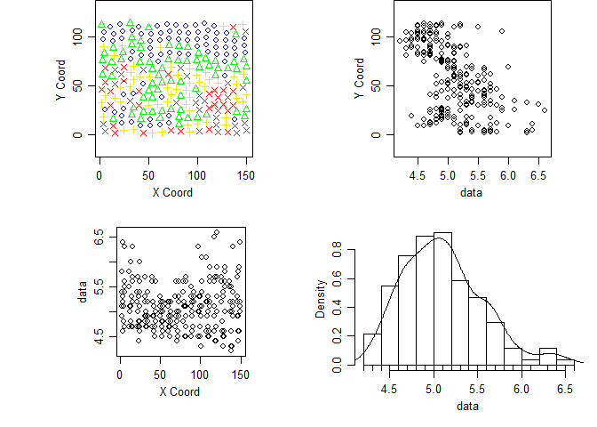
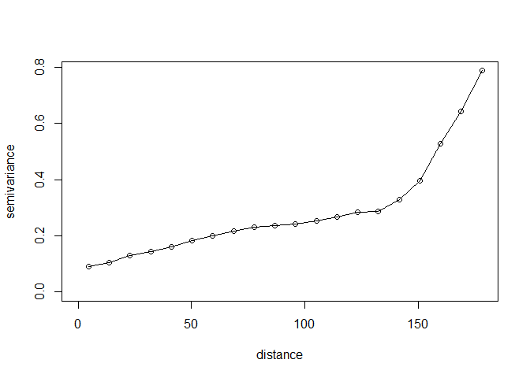
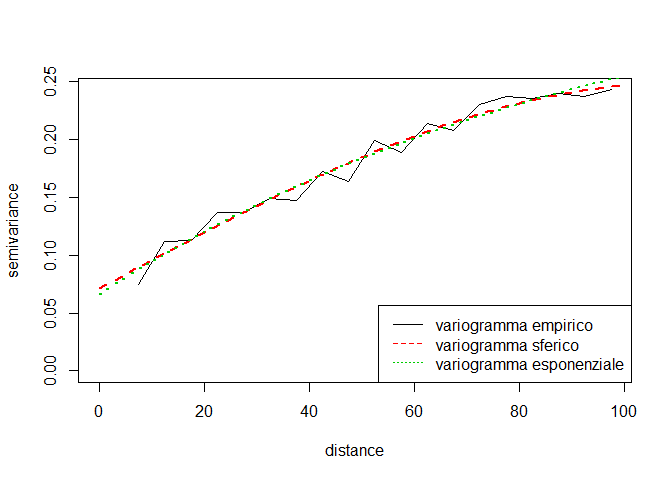
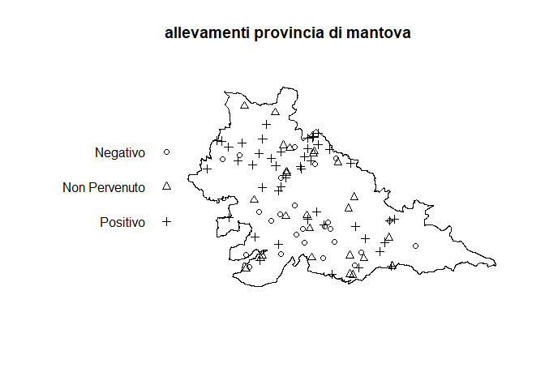
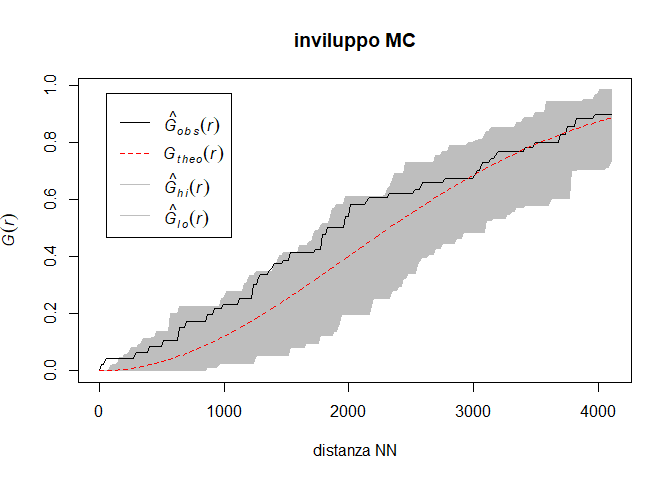
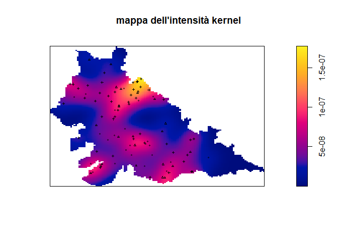

# Esame Aprile 2017


## Esercizio 1

considerare la variabile PH e le coordinate dei punti di misura contenute in soja98 della libreria geoR.

**1) calcolare il variogramma empirico della variabile PH usando 20 distanze:**


```r
library(geoR)
```


```r
d <- soja98[,c("X","Y","PH")]
d.geo <- as.geodata(d, coords.col = 1:2, data.col = 3)
plot(d.geo)
```

<!-- -->

```r
v.geo <- variog(d.geo,	estimator.type="classical", uvec=20)
```

```
## variog: computing omnidirectional variogram
```

```r
plot(v.geo, type='o')
```

<!-- -->

```r
v.geo$n
```

```
##  [1]  305 1239 1871 2516 2716 2936 3086 3140 2961 2721 2446 2041 1600 1164
## [15]  864  559  315  117   35    7
```

```r
v.geo$u
```

```
##  [1]   4.565701  13.697103  22.828505  31.959907  41.091308  50.222710
##  [7]  59.354112  68.485514  77.616916  86.748318  95.879720 105.011121
## [13] 114.142523 123.273925 132.405327 141.536729 150.668131 159.799533
## [19] 168.930934 178.062336
```

```r
v.geo$v  
```

```
##  [1] 0.08947541 0.10532688 0.13111170 0.14443760 0.16043814 0.18389305
##  [7] 0.19970836 0.21704299 0.23230665 0.23546674 0.24161284 0.25471583
## [13] 0.26785937 0.28327320 0.28807870 0.32994633 0.39525397 0.52688034
## [19] 0.64457143 0.78785714
```

Il variogramma empirico mostra un nugget attorno a 0.1 (indice di una componente di variabilità spazialmente non strutturata) e un andamento monotono crescente - questo potrebbe voler significare la presenza di un trend da nord a sud (vedi grafico in cui si nota andamento decrescente in Y). La numerosità delle coppie diminuisce parecchio al crescere della varianza, per questo motivo i valori della coda di destra sono poco affidabili.

**2) stimare il variogramma tramite un modello sferico e un modello esponenziale usando WLS con pesi cressie, max dist = 100 e inizializzando a 0.08 la soglia parziale, 0.07 il nugget e 100 il range**


```r
max.dist = 100
v.geo = variog(d.geo,	estimator.type="classical", uvec=20, max.dist = max.dist)
```

```
## variog: computing omnidirectional variogram
```

```r
variofit.sph <- variofit(v.geo, ini.cov.pars=c(0.08,100), max.dist = max.dist,
		    cov.model="spherical", fix.nugget=FALSE, nugget=0.07, weights = 'cressie')
```

```
## variofit: covariance model used is spherical 
## variofit: weights used: cressie 
## variofit: minimisation function used: optim
```

```r
variofit.exp <- variofit(v.geo, ini.cov.pars=c(0.08,100), max.dist = max.dist,
		    cov.model="exponential", fix.nugget=FALSE, nugget=0.07, weights = 'cressie')
```

```
## variofit: covariance model used is exponential 
## variofit: weights used: cressie 
## variofit: minimisation function used: optim
```

Confronto:


```r
round(
	  rbind(
		  modello.sferico=c(summary(variofit.sph)$estimated.pars,
		     range.effettivo=summary(variofit.sph)$practicalRange,
	  	   SumSquares=summary(variofit.sph)$sum.of.squares)
		  ,
		  modello.esponenziale=c(summary(variofit.exp)$estimated.pars,
		     range.effettivo=summary(variofit.exp)$practicalRange,
		     SumSquares=summary(variofit.exp)$sum.of.squares)
	   ),
	  digits=2)
```

```
##                      tausq sigmasq    phi range.effettivo SumSquares.value
## modello.sferico       0.07    0.18 108.85          108.85            66.88
## modello.esponenziale  0.07    0.30 100.00          299.57            67.85
```

Decifrando:


```r
rbind(
rbind(
  c("modello","nugget", "soglia parziale", "soglia", "range"),
  c("sferico", 0.07, 0.18, 0.25, 108.85)),
  c("esponenziale", 0.07, 0.30, 0.36, 100.00))
```

```
##      [,1]           [,2]     [,3]              [,4]     [,5]    
## [1,] "modello"      "nugget" "soglia parziale" "soglia" "range" 
## [2,] "sferico"      "0.07"   "0.18"            "0.25"   "108.85"
## [3,] "esponenziale" "0.07"   "0.3"             "0.36"   "100"
```

Modello sferico:

$$
\text{Nugget relativo} = \dfrac{0.07}{0.07+0.18} = 0.28
$$

Il 28% della variabilità del modello è spiegata dalla componente "rumore" e quindi non è attribuibile alla struttura spaziale ma ad effetti locali spazialmente non strutturati.

Modello esponenziale:

$$
\text{range} = \frac{\text{range effettivo}}{\log{20}}
$$

**3) riportare il grafico dei due modelli stimati e del variogramma empirico aggiungendo una legenda**


```r
plot(v.geo, type='l')
	lines(variofit.sph,lwd=2, lty=2, col=2)
	lines(variofit.exp,lwd=2, lty=3, col=3)
	legend("bottomright",c("variogramma empirico","variogramma sferico","variogramma esponenziale"),
	       col=c(1:3),lty=c(1:3))
```

<!-- -->

**4) quale dei due modelli presenta un fit migliore?**

Modello sferico presenta un SumSquares.value = 66.88

Modello esponenziale presenta un SumSquares.value = 67.85

Indi per cui il modello sferico è preferibile.


## Esercizio 2

Il file DeseaseMN.csv riporta dati relativi ad alcuni allevamenti della provincia di Mantova sottoposti ad un test sullo stato di salute del bestiame allevato. 

**1) si rappresentino sulla carta gli allevamenti in cui si è manifestato l'evento come un processo di punto marcato con finestra data dallo shape file e marker dal fatto che l'allevamento sia risultato positivo, negativo o non abbia fornito l'esito del test**


```r
require(spatstat)
require(maptools)
require(rgdal)
```


```r
d = read.csv('diseaseMN13.csv', sep=";")
head(d)
```

```
##          E_2013    EST    NORD
## 1      Positivo 608471 5008136
## 2      Negativo 612903 5010954
## 3 Non Pervenuto 638019 4991000
## 4      Negativo 636028 4990863
## 5      Positivo 642021 4992052
## 6      Negativo 642454 4991586
```

```r
summary(d)
```

```
##            E_2013        EST              NORD        
##  Negativo     :25   Min.   :608471   Min.   :4977581  
##  Non Pervenuto:26   1st Qu.:626490   1st Qu.:4987058  
##  Positivo     :45   Median :636229   Median :4997206  
##                     Mean   :636182   Mean   :4999392  
##                     3rd Qu.:644567   3rd Qu.:5011813  
##                     Max.   :668459   Max.   :5026280
```

```r
W = readOGR('MN.shp', verbose = T)
```

```
## OGR data source with driver: ESRI Shapefile 
## Source: "C:\Users\fabio\Documents\github repos\statistica-spaziale\esame_201704\MN.shp", layer: "MN"
## with 1 features
## It has 5 fields
```

```r
ppp = as.ppp(d[,c('EST','NORD','E_2013')], mark=d$E_2013, W=W)
```

```
## Warning: data contain duplicated points
```

```r
summary(ppp)
```

```
## Marked planar point pattern:  96 points
## Average intensity 4.098083e-08 points per square unit
## 
## *Pattern contains duplicated points*
## 
## Coordinates are integers
## i.e. rounded to the nearest unit
## 
## Multitype:
##               frequency proportion    intensity
## Negativo             25  0.2604167 1.067209e-08
## Non Pervenuto        26  0.2708333 1.109897e-08
## Positivo             45  0.4687500 1.920976e-08
## 
## Window: polygonal boundary
## single connected closed polygon with 13384 vertices
## enclosing rectangle: [602828.2, 691622] x [4974186, 5031886] units
## Window area = 2342560000 square units
## Fraction of frame area: 0.457
```

```r
plot(ppp, 'allevamenti provincia di mantova')
```

<!-- -->

Coordinate cartografiche UTM (vedi valori `summary(d)`).

**2) Si consideri solamente gli allevamenti con esito "Positivo". Considerando questo sottoinsieme di eventi si stimi l'intensità del processo rappresentante l'incidenza della malattia sul territorio supponendo che il processo di punto sia un processo di Poisson omogeneo e si interpreti il valore ottenuto.**


```r
d = d[d$E_2013=='Positivo',]
head(d)
```

```
##      E_2013    EST    NORD
## 1  Positivo 608471 5008136
## 5  Positivo 642021 4992052
## 9  Positivo 611264 5016373
## 10 Positivo 614615 5014409
## 11 Positivo 617219 5010496
## 13 Positivo 649911 5009795
```

```r
area=2342560000
(lambda=nrow(d)/area)
```

```
## [1] 1.920975e-08
```

Per calcolare l'intensità in un processo di punto omogeneo si divide il numero di punti complessivi nella regione per la sua area. 

Questo valore rappresenta la stima del numero atteso di casi positivi per unità di superficie.

**3) Usando il sottoinsieme dei dati indicato al punto precedente si esegua un test per la CSR basato sulla distanza dal vicino più vicino. Si riportino su un grafico le curve rilevanti per l'analisi, gli inviluppi Montecarlo e un'opportuna legenda esplicativa. Si riporti sull'asse di ascissa la variabile in esso rappresentata tramite un'opportuna etichetta. Per l'analisi si eseguano 50 replicazioni Montecarlo fissando il seme della generazione casuale tramite il valore 1024. Si riporti il codice necessario all'analisi eseguita nei punti 2. e 3. e una breve interpretazione del risultato ottenuto.**


```r
set.seed(1024)
envpp<-envelope(ppp,fun=Gest,nsim=50,verbose=TRUE,saveall=F)
```

```
## Generating 50 simulations of CSR  ...
## 1, 2, 3, 4, 5, 6, 7, 8, 9, 10, 11, 12, 13, 14, 15, 16, 17, 18, 19, 20, 21, 22, 23, 24, 25, 26, 27, 28, 29, 30, 31, 32, 33, 34, 35, 36, 37, 38,
## 39, 40, 41, 42, 43, 44, 45, 46, 47, 48, 49,  50.
## 
## Done.
```

```r
a = plot(envpp,main="inviluppo MC",xlab="distanza NN")
```

<!-- -->

Alla luce del grafico precedente l'ipotesi di CSR appare ragionevolmente supportata dai dati in quanto la funzione di ripartizione empirica si trova ad ogni valore delle distanze
all'interno degli inviluppi Monte Carlo, seguendo l'andamento della funzione di ripartizione teorica.

**4) Aggiuntivo: grafico dell'intensità**


```r
Z <- density.ppp(ppp, varcov=diag( c(var(d$EST),var(d$NORD))/16))
plot(Z,main="mappa dell'intensità kernel"); 
plot(ppp,add=T,cex=0.4)
```

<!-- -->


