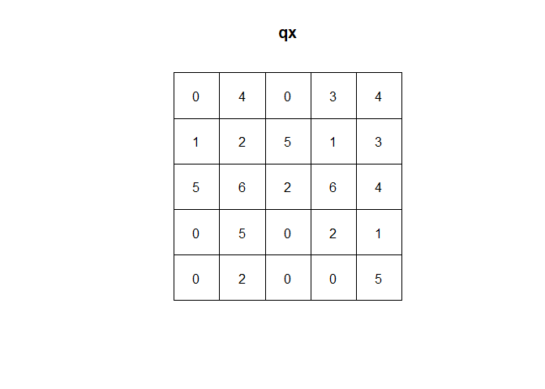
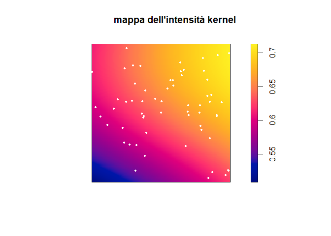

# Esame Giugno 2017

## Esercizio 1

File `dat.csv` contiene i dati.

I file PE.shp, PE.shx, PE.dbf riportano i confini geografici della regione di studio a cui i dati sono riferiti che rappresenta un bacino collocato in una regione italiana.

**1) Si esegua una sintetica analisi esplorativa dei dati, evidenziandone le caratteristiche principali. Si dica quale potrebbe essere il sistema di riferimento geografico utilizzato e il significato delle coordinate dei punti di misura.**


```r
library(geoR)
library(spatstat)
library(rgdal)
library(maptools)
library(ggplot2)
```


```r
d = read.csv('dat.csv', sep=';')
head(d)
```

```
##         x       y    valori
## 1 2435616 4687588 150.00000
## 2 2444851 4687588  43.82099
## 3 2454928 4701664  40.84944
## 4 2432943 4674498  31.99267
## 5 2448282 4693927  24.30378
## 6 2447220 4693792  26.20944
```

```r
summary(d)
```

```
##        x                 y               valori      
##  Min.   :2429574   Min.   :4673244   Min.   : 16.64  
##  1st Qu.:2438615   1st Qu.:4686067   1st Qu.: 26.85  
##  Median :2444961   Median :4690243   Median : 33.85  
##  Mean   :2444007   Mean   :4689813   Mean   : 33.93  
##  3rd Qu.:2449732   3rd Qu.:4694112   3rd Qu.: 37.73  
##  Max.   :2456584   Max.   :4702377   Max.   :150.00
```

```r
d.geo = as.geodata(d, coords.col = 1:2, data.col = 3)
plot(d.geo, lowess = T, scatter3d = T)
```

<!-- -->

Non sembrano esserci evidenze di trend né nella direzione Nord-Sud né Est-Ovest. Tuttavia si può osservare un outlier molto evidente. Le coordinate sono cartografiche, con codifica Gauss-Boaga.

Mappa:


```r
poly = readOGR('PE.shp', verbose=T)
```

```
## OGR data source with driver: ESRI Shapefile 
## Source: "C:\Users\fabio\Documents\github repos\statistica-spaziale\esame_201706\PE.shp", layer: "PE"
## with 1 features
## It has 2 fields
```

```r
par(cex=0.8)
points(d.geo,pt.divide="quintiles", col=1:5, main='mappa')
plot(poly, add=T)
legend('bottomright', pch=19, col=1:5, pt.cex=(1:5)/3,
       c("1° quintile","2° quintile","3° quintile","4° quintile","5° quintile"))
```

<!-- -->

**2) Si calcoli il variogramma empirico della variabile “valori” usando 16 distanze (bin) per la sua costruzione. Se ne produca il grafico e si trascrivano, negli spazi sotto riportati, i valori del variogramma empirico e i valori delle corrispondenti distanze, approssimati al primo decimale. Si discuta sinteticamente come sono trattate eventuali inconsistenze nei dati**


```r
v.geo = variog(d.geo, uvec = 16)
```

```
## variog: computing omnidirectional variogram
```

```r
plot(v.geo, type='o', pch=19)
```

<!-- -->

```r
round(v.geo$u,1) # distanze
```

```
##  [1]  1162.5  3487.4  5812.4  8137.3 10462.3 12787.2 15112.2 17437.1
##  [9] 19762.1 22087.0 24412.0 26736.9 29061.9 31386.8 33711.8 36036.7
```

```r
round(v.geo$v,1) # valori
```

```
##  [1]  33.8 195.1 196.6 237.5 235.3 346.1 195.8 149.9 249.0 262.8 258.0
## [12]  52.7  44.1  44.2  59.7  97.9
```

Provo a togliere l'outlier:


```r
par(cex=0.6)
plot(d$x, d$y, col='white')
text(d$x, d$y, labels = 1:90)
```

<!-- -->

```r
d2 = d[-1,]
d2.geo = as.geodata(d2, coords.col = 1:2, data.col = 3)
plot(d2.geo, lowess = T, scatter3d = T)
```

<!-- -->

```r
par(cex=0.8)
points(d2.geo,pt.divide="quintiles", col=1:5, main='mappa')
plot(poly, add=T)
legend('bottomright', pch=19, col=1:5, pt.cex=(1:5)/3,
       c("1° quintile","2° quintile","3° quintile","4° quintile","5° quintile"))
```

<!-- -->

Avendo tolto l'outlier sembrano emergere dei lievi trend sia NS sia EO.


```r
v.geo = variog(d2.geo, uvec = 16)
```

```
## variog: computing omnidirectional variogram
```

```r
plot(v.geo, type='o', pch=19)
```

<!-- -->

```r
round(v.geo$u,1) # distanze
```

```
##  [1]  1162.5  3487.4  5812.4  8137.3 10462.3 12787.2 15112.2 17437.1
##  [9] 19762.1 22087.0 24412.0 26736.9 29061.9 31386.8 33711.8 36036.7
```

```r
round(v.geo$v,1) # valori
```

```
##  [1] 33.8 36.3 39.8 51.9 59.7 53.3 57.5 65.7 60.7 76.5 50.6 52.7 44.1 44.2
## [15] 59.7 97.9
```

```r
round(v.geo$n,1) # frequenze
```

```
##  [1] 254 488 434 405 428 390 361 301 235 191 137  97  43  73  41  37
```


Abbiamo rimosso l’outlier precedentemente identificato. Negli ultimi 5 bin ci sono meno di 100 coppie di osservazioni, quindi le stime potrebbero essere distorte: potremmo quindi andare a considerare una distanza max di 25000.

Nugget=35 soglia=60 range=10000

**3) Si esegua un’opportuna diagnostica grafica di tipo Monte Carlo per evidenziare se, nel dataset considerato, la dipendenza spaziale risulta significativamente rilevante oppure no. Si riporti e si commenti il grafico nello spazio predisposto. Ai fini dell’analisi Montecarlo si inizializzi la generazione casuale con il valore 17628 e si eseguano 80 simulazioni indipendenti per implementare la diagnostica.**


```r
set.seed(17628)
d.env <- variog.mc.env(d2.geo, obj.v = v.geo, nsim = 80, save.sim=T)
```

```
## variog.env: generating 80 simulations by permutating data values
## variog.env: computing the empirical variogram for the 80 simulations
## variog.env: computing the envelops
```

```r
plot(v.geo, type='o', pch=19, envelope = d.env)
```

<!-- -->

Come si evince dal grafico che raffronta il variogramma empirico con un situazione di assenza di dipendenza spaziale (situazione di nugget puro) abbiamo che il semivariogramma empirico va al di sotto e al di sopra delle bande riportate. Ciò evidenzia forte dipendenza spaziale. E’ importante guardare come si comporta a basse distanze, perché ovviamente nella “coda” di destra le stime sono instabili e non del tutto attendibili.

**4) Si stimi il variogramma tramite un modello sferico usando i minimi quadrati ordinari, fissando la massima distanza a cui calcolare il variogramma empirico a 35000 e inizializzando la procedura con il valore 25 per la soglia parziale, 10 per il nugget e 5000 per il range. Si riportino i valori stimati dei parametri: range, soglia e nugget. Si calcoli il nugget relativo in termini percentuali interpretando sinteticamente il valore ottenuto. Si scriva l’equazione del modello di semivariogramma stimato. Si riportino tutti i valori approssimati al primo decimale.**


```r
m = 35000
v.geo = variog(d2.geo, uvec = 16, max.dist = m)
```

```
## variog: computing omnidirectional variogram
```

```r
v.fit.ols = variofit(v.geo,
	  	ini.cov.pars=c(25,5000),
		  cov.model="spherical", fix.nugget=FALSE,nugget=10, weights = "equal")
```

```
## variofit: covariance model used is spherical 
## variofit: weights used: equal 
## variofit: minimisation function used: optim
```

```r
# summary(v.fit.ols)
(range = round(v.fit.ols$practicalRange,1))
```

```
## [1] 13643.4
```

```r
(nugget = round(v.fit.ols$nugget,1))
```

```
## [1] 27.8
```

```r
(soglia = round(28.42377,1))
```

```
## [1] 28.4
```

```r
(nugget.rel = round(nugget/(nugget+soglia),1))
```

```
## [1] 0.5
```

Equazione del modello:

$$
\gamma(h)=27.8+28.4\biggl( 1.5\frac{h}{13643.4} - 0.5\frac{h}{13643.4}^3 \biggr) 
$$
se $0<h<1.5<13643.4$. Altrimenti $\gamma(h)=56.2$

**5) Si riporti il grafico del modello stimato e del variogramma empirico.**


```r
plot(v.geo, type='o')
lines(v.fit.ols, col=2, lwd=2, lty=2)
legend("bottomright",c("variogramma empirico","variogramma sferico - OLS"),
      col=c(1:2),lty=c(1:2), lwd=c(1:2))
```

<!-- -->

**6) Usando le stime ottenute al punto 4, si riporti nello spazio di seguito predisposto la mappa ottenuta tramite kriging ordinario corredata da un’opportuna legenda usando una griglia regolare 50×50 per discretizzare la superficie. Si rappresenti solamente la superficie delle concentrazioni all’interno dello shape file della regione di studio. Si riportino sulla mappa i punti di misura del campione. Nel caso non si sia in grado di stimare il variogramma tramite OLS si utilizzino per la previsione i valori iniziali indicati al punto 4**


```r
poligono <- fortify(poly)
```

```
## Regions defined for each Polygons
```

```r
p=as.matrix(poligono[,c("long","lat")])
X=bbox(poly)[1,]
Y=bbox(poly)[2,]
size=50
YY<-round(seq(ceiling(min(Y)),floor(max(Y)), length=size),2)
XX<-round(seq(ceiling(min(X)),floor(max(X)), length=size),2)
griglia<-expand.grid(X=XX,Y=YY)
dim(griglia)
```

```
## [1] 2500    2
```

```r
plot(griglia,cex=0.1)
plot(poly,add=T)
```

<!-- -->

```r
krg.or <- krige.conv(geodata=d2.geo, 
                     loc=griglia,
                     krige=krige.control(cov.pars=v.fit.ols$cov.pars,
                                        cov.model=v.fit.ols$cov.model,
                                        nugget=v.fit.ols$nugget),
                     borders=p)
```

```
## krige.conv: results will be returned only for prediction locations inside the borders
## krige.conv: model with constant mean
## krige.conv: Kriging performed using global neighbourhood
```

```r
#grafico
par(cex=0.75)
image(krg.or) 
legend.krige(x.leg=c(2460000, 2463000), y.leg=c(4675000, 4695000), val=krg.or$predict,
             vert=TRUE, off=0.7, scale.vals=pretty(krg.or$predict)
)
points(d2$x,d2$y)
```

<!-- -->


## Esercizio 2

Il file datpp.csv riporta dati relativi ad un point pattern realizzatosi in una regione quadrata di lato 10 e vertice basso a sinistra sull’origine degli assi cartesiani. Il file contiene due colonne: x: ascissa dell’evento y: ordinata dell’evento

**1) Si rappresenti su un grafico il point pattern e la relativa finestra e lo si riporti nello spazio indicato.**


```r
datapp <- read.csv("datpp.csv",sep=";")
head(datapp)
```

```
##          x         y
## 1 3.147405 0.8417254
## 2 8.044105 8.9740405
## 3 5.672546 7.3766717
## 4 2.731944 2.7011612
## 5 5.057083 5.8460857
## 6 3.770976 4.7664609
```

```r
summary(datapp)
```

```
##        x                 y         
##  Min.   :0.01796   Min.   :0.2921  
##  1st Qu.:3.14741   1st Qu.:4.0800  
##  Median :5.86633   Median :5.5683  
##  Mean   :5.57374   Mean   :5.4132  
##  3rd Qu.:8.11198   3rd Qu.:7.3767  
##  Max.   :9.93700   Max.   :9.6925
```

```r
W <- owin(c(0,10), c(0,10))
{plot(W, main= "Realizzazioni del point pattern")
points(datapp)}
```

<!-- -->

**2) Si riporti il numero di eventi del point pattern e si stimi l’intensità del processo di punto supponendo che il processo sia di Poisson omogeneo. Si interpreti il valore ottenuto.**


```r
area=100
(n=nrow(datapp))
```

```
## [1] 61
```

```r
(lambdahat=n/area)
```

```
## [1] 0.61
```

Se il processo è HPP allora l’intensità è costante e pari al valore atteso diviso l’area. In questo caso ci aspettiamo in ogni quadrato di lato 1x1, 0.61 osservazioni in media. Il numero di osservazioni è proporzionale all’ampiezza dell’area considerata con costante di proporzionalità pari a 0.61. Al crescere di questa costante di proporzionalità di aspettiamo un numero di eventi maggiore per unità di area.

**3) Si esegua un test per la presenza di CSR contro un’ipotesi alternativa che il processo abbia una struttura clusterizzata. SI utilizzi il metodo dei Quadrat Count usando un insieme di 25 celle ottenute suddividendo il range delle ascisse e quello delle ordinate in 5 classi. Si riporti il risultato ottenuto negli spazi predisposti e lo si interpreti. Si riporti l’istruzione R utilizzata.**


```r
pp <- as.ppp(datapp, W)
qx<-quadratcount(pp,5,5)  ### griglia 5x5
plot(qx)
```

<!-- -->

```r
te0<-quadrat.test(pp,5, alternative="clustered"); te0
```

```
## Warning: Some expected counts are small; chi^2 approximation may be
## inaccurate
```

```
## 
## 	Chi-squared test of CSR using quadrat counts
## 	Pearson X2 statistic
## 
## data:  pp
## X2 = 44.328, df = 24, p-value = 0.006987
## alternative hypothesis: clustered
## 
## Quadrats: 5 by 5 grid of tiles
```

Dato che il pvalue associato è inferiore alle soglie critiche comunemente considerate (0.01, 0.05, 0.1), allora a questi livelli di significatività possiamo rifiutare l’ipotesi nulla di CSR andando a favore dell’ipotesi alternativa di clustering.

**4) Si riporti il grafico dell’intensità stimata tramite il metodo kernel ponendo pari a 5 la finestra di lisciamento sia per i valori di ascissa che per quelli di ordinata. Si aggiungano al grafico gli eventi osservati in colore bianco. Si riporti la mappa nell’area predisposta del presente file. **


```r
Z <- density.ppp(pp, 5)
{plot(Z,main="mappa dell'intensità kernel"); 
plot(pp,add=T,cex=0.6,col="white", pch=19)}
```

<!-- -->

**5) Tra i due metodi usati per stimare l’intensità (quello al punto 2. e quello al punto 4.) quale ritenete essere il più adeguato e perché?**

Tra i due metodi utilizzati, quello con il Kernel e quello con un processo omogeneo, al fine di stimare l’intensità risulta più opportuno utilizzare uno stimatore Kernel dato che il test condotto coi Quadrat Count fa propendere per una struttura di clustering. Quindi utilizzare lo stimatore che si utilizza in caso di processo omogeneo in questa situazione non è corretto poiché porta a sostanziali distorsioni e stime non affidabili.


