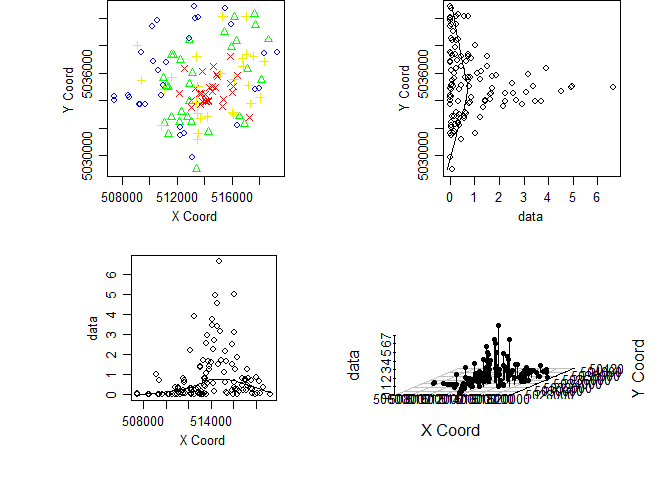
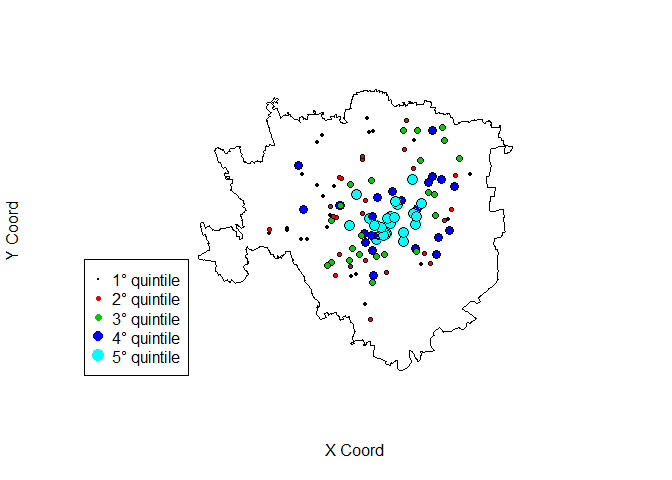
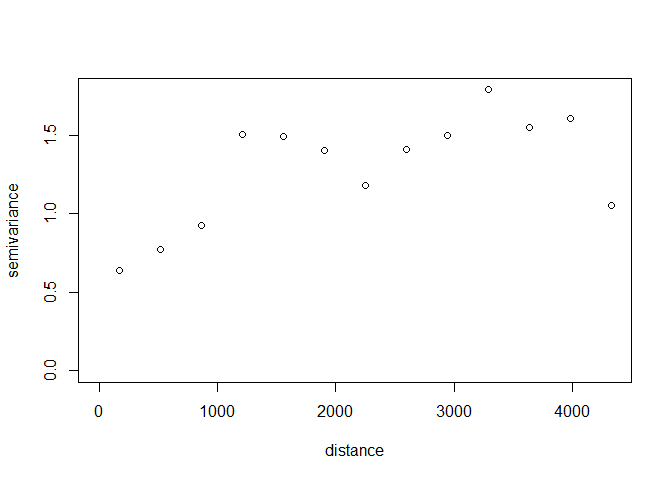

# esame_201804


```r
require(geoR)
```

```
## Loading required package: geoR
```

```
## --------------------------------------------------------------
##  Analysis of Geostatistical Data
##  For an Introduction to geoR go to http://www.leg.ufpr.br/geoR
##  geoR version 1.7-5.2.1 (built on 2016-05-02) is now loaded
## --------------------------------------------------------------
```

```r
require(maptools)
```

```
## Loading required package: maptools
```

```
## Loading required package: sp
```

```
## Checking rgeos availability: FALSE
##  	Note: when rgeos is not available, polygon geometry 	computations in maptools depend on gpclib,
##  	which has a restricted licence. It is disabled by default;
##  	to enable gpclib, type gpclibPermit()
```

```r
require(rgdal)
```

```
## Loading required package: rgdal
```

```
## rgdal: version: 1.4-3, (SVN revision 828)
##  Geospatial Data Abstraction Library extensions to R successfully loaded
##  Loaded GDAL runtime: GDAL 2.2.3, released 2017/11/20
##  Path to GDAL shared files: C:/Users/fabio/Documents/R/win-library/3.4/rgdal/gdal
##  GDAL binary built with GEOS: TRUE 
##  Loaded PROJ.4 runtime: Rel. 4.9.3, 15 August 2016, [PJ_VERSION: 493]
##  Path to PROJ.4 shared files: C:/Users/fabio/Documents/R/win-library/3.4/rgdal/proj
##  Linking to sp version: 1.3-1
```

```r
d <- read.csv('datind.csv', sep = ';')
```

## Esercizio 1

**1) Si descriva sinteticamente il dataset:**


```r
str(d)
```

```
## 'data.frame':	119 obs. of  3 variables:
##  $ index: num  0.042342 0.233349 1.419507 1.716106 0.000788 ...
##  $ long : num  511020 512282 513006 514949 510260 ...
##  $ lat  : num  5035139 5033161 5034047 5035747 5036881 ...
```

```r
summary(d)
```

```
##      index               long             lat         
##  Min.   :0.000126   Min.   :507409   Min.   :5029007  
##  1st Qu.:0.066258   1st Qu.:511905   1st Qu.:5033721  
##  Median :0.347038   Median :513578   Median :5035025  
##  Mean   :0.892050   Mean   :513776   Mean   :5035299  
##  3rd Qu.:1.247947   3rd Qu.:515989   3rd Qu.:5036921  
##  Max.   :6.636501   Max.   :519276   Max.   :5040853
```

Sono presenti 119 osservazioni. Le tre variabili corrispondono alla variabile risposta (index) e alle due coordinate cartografiche (long e lat), espresse secondo la codifica UTM. 

**2) Analisi esplorativa di larga scala:**


```r
d.geo = as.geodata(d, coords.col=2:3, data.col=1)
d.poly = readOGR("Milano.shp", verbose=T)
```

```
## OGR data source with driver: ESRI Shapefile 
## Source: "C:\Users\fabio\Downloads\Appello_20180419\Milano.shp", layer: "Milano"
## with 1 features
## It has 9 fields
## Integer64 fields read as strings:  COD_ISTAT
```

```r
plot.geodata(d.geo,scatter3d = TRUE, lowess=T)
```

<!-- -->

```r
plot(d.poly, ylab = 'Y Coord', xlab = 'X Coord')
points.geodata(d.geo,pt.divide="quintiles", col=1:5, add=T)
legend(496500, 5032500, pch=19, col=1:5, pt.cex=(1:5)/3,
    c("1° quintile","2° quintile","3° quintile","4° quintile","5° quintile"))
```

<!-- -->

I dati presentano valori alti nel centro di Milano, com'era immaginabile. Questo trend si può osservare sia lungo la direzione nord-sud sia est-ovest. 

**3) Calcolare il variogramma empirico**


```r
variog.emp <- variog(d.geo, estimator.type="classical", uvec=20)
```

```
## variog: computing omnidirectional variogram
```

```r
plot(variog.emp, type='o')
```

<!-- -->

**4) Riportare i valori del variogramma empirico e del numero di coppie di punti per ciascun lag**


```r
(rbind(round(variog.emp$v,2), round(variog.emp$n)))
```

```
##        [,1]   [,2]  [,3]   [,4]   [,5]   [,6]   [,7]   [,8]   [,9]  [,10]
## [1,]   0.62   1.27   1.6   1.54   1.88   2.36   2.11   1.77   1.84   1.75
## [2,] 105.00 307.00 420.0 581.00 653.00 708.00 679.00 680.00 580.00 565.00
##       [,11]  [,12]  [,13]  [,14] [,15] [,16] [,17] [,18] [,19] [,20]
## [1,]   1.28   1.06   0.52   0.18   0.3  0.11  0.11  0.07  0.09  0.03
## [2,] 482.00 394.00 272.00 215.00 168.0 98.00 58.00 31.00 16.00  8.00
```

**5) Si detrendizzino i dati con un polinomio di secondo grado e riportare il variogramma:**


```r
variog.detrend <- variog(d.geo,trend='2nd', estimator.type="classical", uvec=13, max.dist = 4500)	
```

```
## variog: computing omnidirectional variogram
```

```r
plot(variog.detrend)
```

<!-- -->

**6) A partire dal variog empirico ottenuto al punto precedente stimare il modello exp tramite WLS**

Inizializzare con sistema di pesi Cressie e valori Nugget = 0.5, Soglia parziale = 1, Range = 1000


```r
variog.fit <- variofit(variog.detrend, ini.cov.pars = c(1,1000), cov.model="exponential", fix.nugget=FALSE, nugget=0.5, weights = 'cressie')
```

```
## variofit: covariance model used is exponential 
## variofit: weights used: cressie 
## variofit: minimisation function used: optim
```

```r
summary(variog.fit)
```

```
## $pmethod
## [1] "WLS (weighted least squares)"
## 
## $cov.model
## [1] "exponential"
## 
## $spatial.component
##    sigmasq        phi 
##   1.196916 747.674590 
## 
## $spatial.component.extra
## kappa 
##   0.5 
## 
## $nugget.component
##     tausq 
## 0.3280153 
## 
## $fix.nugget
## [1] FALSE
## 
## $fix.kappa
## [1] TRUE
## 
## $practicalRange
## [1] 2239.833
## 
## $sum.of.squares
##    value 
## 83.90728 
## 
## $estimated.pars
##       tausq     sigmasq         phi 
##   0.3280153   1.1969161 747.6745898 
## 
## $weights
## [1] "cressie"
## 
## $call
## variofit(vario = variog.detrend, ini.cov.pars = c(1, 1000), cov.model = "exponential", 
##     fix.nugget = FALSE, nugget = 0.5, weights = "cressie")
## 
## attr(,"class")
## [1] "summary.variomodel"
```

Stime:

* nugget=0.328

* soglia parziale=1.197

* range effettivo=2239.83

* nugget relativo=0.328/(0.328+1.197)=0.21

**4) Effettuare una previsione kriging di index in (long=514650.73 , lat=5033907.12) con i dati detrendizzati**


```r
g = data.frame(t(c(long=514650.73, lat=5033907.12)))
m = lm(index~lat+long+I(lat^2)+I(long^2)+lat:long, data=d)

data.geol = as.geodata(data.frame(d, res=resid(m)), coords.col = 2:3, data.col = 4)
krg = krige.conv(data.geol, loc=g, 
                 krige=krige.control(type.krige = "SK", beta=0,
                                     cov.pars = variog.fit$cov.pars,
                                     cov.model = "exponential",
                                     nugget = variog.fit$nugget))
```

```
## krige.conv: model with constant mean
## krige.conv: Kriging performed using global neighbourhood
```

```r
predict(m,g)+krg$predict
```

```
##        1 
## 2.492116
```

