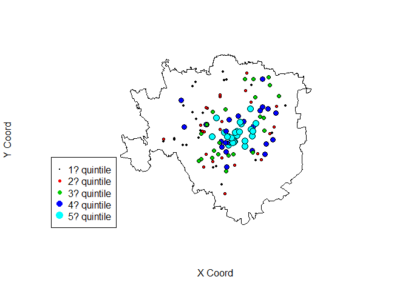
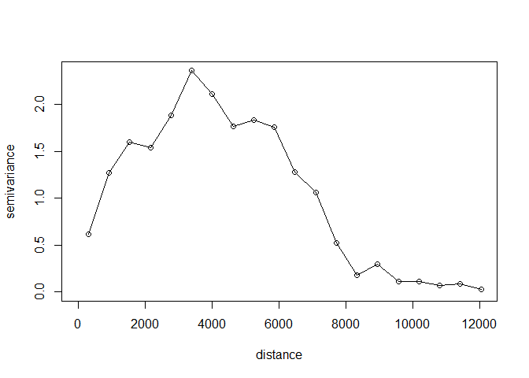
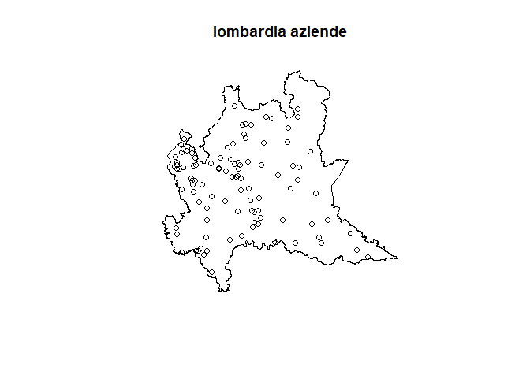
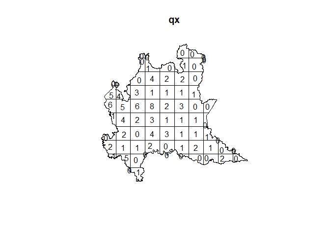
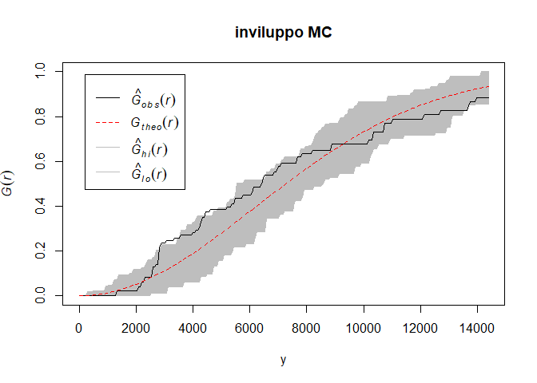
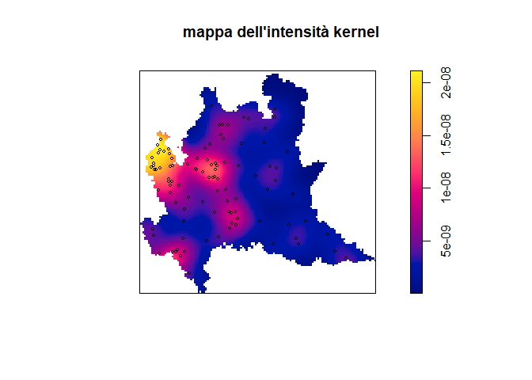

# Esame Aprile 2018

## Esercizio 1

```r
require(geoR)
require(maptools)
require(rgdal)
```

**1) Si descriva sinteticamente il dataset:**


```r
d <- read.csv('datind.csv', sep = ';')
str(d)
```

```
## 'data.frame':	119 obs. of  3 variables:
##  $ index: num  0.042342 0.233349 1.419507 1.716106 0.000788 ...
##  $ long : num  511020 512282 513006 514949 510260 ...
##  $ lat  : num  5035139 5033161 5034047 5035747 5036881 ...
```

```r
summary(d)
```

```
##      index               long             lat         
##  Min.   :0.000126   Min.   :507409   Min.   :5029007  
##  1st Qu.:0.066258   1st Qu.:511905   1st Qu.:5033721  
##  Median :0.347038   Median :513578   Median :5035025  
##  Mean   :0.892050   Mean   :513776   Mean   :5035299  
##  3rd Qu.:1.247947   3rd Qu.:515989   3rd Qu.:5036921  
##  Max.   :6.636501   Max.   :519276   Max.   :5040853
```

Sono presenti 119 osservazioni. Le tre variabili corrispondono alla variabile risposta (index) e alle due coordinate cartografiche (long e lat), espresse secondo la codifica UTM. 

**2) Analisi esplorativa di larga scala:**


```r
d.geo = as.geodata(d, coords.col=2:3, data.col=1)
d.poly = readOGR("Milano.shp", verbose=T)
```

```
## OGR data source with driver: ESRI Shapefile 
## Source: "C:\Users\fabio\Documents\github repos\statistica-spaziale\esame_201804\Milano.shp", layer: "Milano"
## with 1 features
## It has 9 fields
## Integer64 fields read as strings:  COD_ISTAT
```

```r
plot.geodata(d.geo,scatter3d = TRUE, lowess=T)
```

<!-- -->

```r
plot(d.poly, ylab = 'Y Coord', xlab = 'X Coord')
points.geodata(d.geo,pt.divide="quintiles", col=1:5, add=T)
legend(496500, 5032500, pch=19, col=1:5, pt.cex=(1:5)/3,
    c("1? quintile","2? quintile","3? quintile","4? quintile","5? quintile"))
```

<!-- -->

I dati presentano valori alti nel centro di Milano, com'era immaginabile. Questo trend campanulare si può osservare sia lungo la direzione nord-sud sia est-ovest. 

**3) Calcolare il variogramma empirico**


```r
variog.emp <- variog(d.geo, estimator.type="classical", uvec=20)
```

```
## variog: computing omnidirectional variogram
```

```r
plot(variog.emp, type='o')
```

<!-- -->

**4) Riportare i valori del variogramma empirico e del numero di coppie di punti per ciascun lag**


```r
(rbind(round(variog.emp$v,2), round(variog.emp$n)))
```

```
##        [,1]   [,2]  [,3]   [,4]   [,5]   [,6]   [,7]   [,8]   [,9]  [,10]
## [1,]   0.62   1.27   1.6   1.54   1.88   2.36   2.11   1.77   1.84   1.75
## [2,] 105.00 307.00 420.0 581.00 653.00 708.00 679.00 680.00 580.00 565.00
##       [,11]  [,12]  [,13]  [,14] [,15] [,16] [,17] [,18] [,19] [,20]
## [1,]   1.28   1.06   0.52   0.18   0.3  0.11  0.11  0.07  0.09  0.03
## [2,] 482.00 394.00 272.00 215.00 168.0 98.00 58.00 31.00 16.00  8.00
```

**5) Si detrendizzino i dati con un polinomio di secondo grado e riportare il variogramma:**


```r
variog.detrend <- variog(d.geo,trend='2nd', estimator.type="classical", uvec=13, max.dist = 4500)	
```

```
## variog: computing omnidirectional variogram
```

```r
plot(variog.detrend)
```

<!-- -->

**6) A partire dal variog empirico ottenuto al punto precedente stimare il modello exp tramite WLS**

Inizializzare con sistema di pesi Cressie e valori Nugget = 0.5, Soglia parziale = 1, Range = 1000


```r
variog.fit <- variofit(variog.detrend, ini.cov.pars = c(1,1000), cov.model="exponential", fix.nugget=FALSE, nugget=0.5, weights = 'cressie')
```

```
## variofit: covariance model used is exponential 
## variofit: weights used: cressie 
## variofit: minimisation function used: optim
```

```r
summary(variog.fit)
```

```
## $pmethod
## [1] "WLS (weighted least squares)"
## 
## $cov.model
## [1] "exponential"
## 
## $spatial.component
##    sigmasq        phi 
##   1.196916 747.674590 
## 
## $spatial.component.extra
## kappa 
##   0.5 
## 
## $nugget.component
##     tausq 
## 0.3280153 
## 
## $fix.nugget
## [1] FALSE
## 
## $fix.kappa
## [1] TRUE
## 
## $practicalRange
## [1] 2239.833
## 
## $sum.of.squares
##    value 
## 83.90728 
## 
## $estimated.pars
##       tausq     sigmasq         phi 
##   0.3280153   1.1969161 747.6745898 
## 
## $weights
## [1] "cressie"
## 
## $call
## variofit(vario = variog.detrend, ini.cov.pars = c(1, 1000), cov.model = "exponential", 
##     fix.nugget = FALSE, nugget = 0.5, weights = "cressie")
## 
## attr(,"class")
## [1] "summary.variomodel"
```

Stime:

* nugget=0.328

* soglia parziale=1.197

* range effettivo=2239.83

* nugget relativo=0.328/(0.328+1.197)=0.21

Formula del variogramma (stimato):

$$\gamma(h) = 0.328 + 1.197\Bigl(1-\exp\Bigl\{\frac{h}{747.67}\Bigr\}\Bigr) $$

**4) Effettuare una previsione kriging di index in (long=514650.73 , lat=5033907.12) con i dati detrendizzati**


```r
g = data.frame(t(c(long=514650.73, lat=5033907.12)))
m = lm(index~lat+long+I(lat^2)+I(long^2)+lat:long, data=d)

data.geol = as.geodata(data.frame(d, res=resid(m)), coords.col = 2:3, data.col = 4)
krg = krige.conv(data.geol, loc=g, 
                 krige=krige.control(type.krige = "SK", beta=0,
                                     cov.pars = variog.fit$cov.pars,
                                     cov.model = "exponential",
                                     nugget = variog.fit$nugget))
```

```
## krige.conv: model with constant mean
## krige.conv: Kriging performed using global neighbourhood
```

```r
predict(m,g)+krg$predict
```

```
##        1 
## 2.492116
```

## Esercizio 2

**1) Definire un point pattern formato dalle locazioni delle aziende usando i confini amministrativi della Lombardia come finestra del processo**


```r
require(rgdal)
require(spatstat)
require(maptools)
```


```r
lomb.poly <- readOGR("Lombardia_UTMWGS84.shp", verbose=T)
```

```
## OGR data source with driver: ESRI Shapefile 
## Source: "C:\Users\fabio\Documents\github repos\statistica-spaziale\esame_201804\Lombardia_UTMWGS84.shp", layer: "Lombardia_UTMWGS84"
## with 1 features
## It has 6 fields
## Integer64 fields read as strings:  RG_ RG_ID
```

```r
d <- read.csv("aziende.csv", sep=';')
ppp = as.ppp(d,W=lomb.poly)

plot(ppp, main='lombardia aziende')
```

<!-- -->

**2) Si valuti l'ipotesi di un test CSR con un opportuno test grafico. Si producano gli sviluppi MC utilizzando 25 iter e settando il seed 1804**


```r
qx<-quadratcount(ppp,10,10)	### tabella 4x4
plot(qx)
```

<!-- -->

```r
set.seed(1804)
envpp<-envelope(ppp,fun=Gest,nsim=25,nrank=,verbose=TRUE,saveall=F)
```

```
## Generating 25 simulations of CSR  ...
## 1, 2, 3, 4, 5, 6, 7, 8, 9, 10, 11, 12, 13, 14, 15, 16, 17, 18, 19, 20, 21, 22, 23, 24,  25.
## 
## Done.
```

```r
a = plot(envpp,main="inviluppo MC",xlab="y")
```

<!-- -->

Dal test grafico si osserva che la funzione di rip. empirica è contenuta nelle bande degli inviluppi, salvo piccoli discostamenti. Ciò fa propendere per l'accettazione dell'ipotesi che il processo sia un CSR, ovvero un processo di punto omogeneo. In tal caso NON è possibile ipotizzare un comportamento competitivo delle aziende sul territorio né la presenza di potenziali economie di scala derivanti dall'addensamento sul territorio di infrastrutture a supporto delle aziende; si può pensare anzi alla presenza di aziende distribuite sul territorio in situazione di concorrenza perfetta. 

**3) si produca una stima dell'intensità del processo**


```r
Z <- density.ppp(ppp, varcov=diag( c(var(d$long),var(d$lat))/16))
plot(Z,main="mappa dell'intensità kernel"); 
plot(ppp,add=T,cex=0.6,col="black")
```

<!-- -->

Avendo concluso che l'ipotesi di CSR fosse compatibile coi dati a disposizione, si è stimata l'intensità facendo rapporto tra la numerosità delle aziende sul territorio (100) e l'area della regione Lombardia


```r
f = 1e+6
(area = lomb.poly$AREA/f) # kmq
```

```
## [1] 23869.53
```

```r
(n = nrow(d)) # numero birrifici
```

```
## [1] 100
```

```r
(lambda = n/area) # intensità per 1kmq
```

```
## [1] 0.004189442
```

```r
(lambda*20)
```

```
## [1] 0.08378884
```

Questo valore è il numero di aziende attese per 20kmq.
