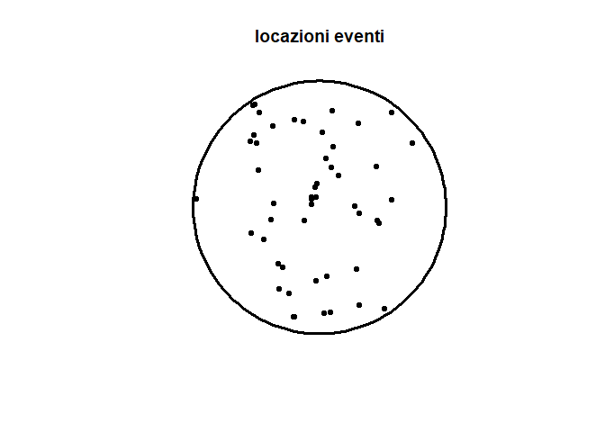
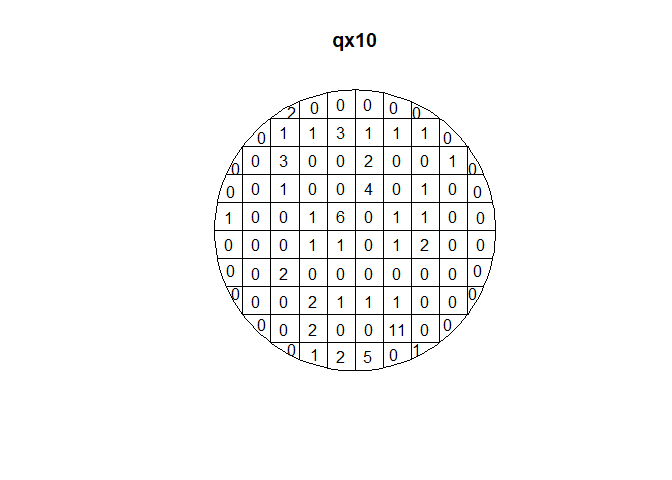
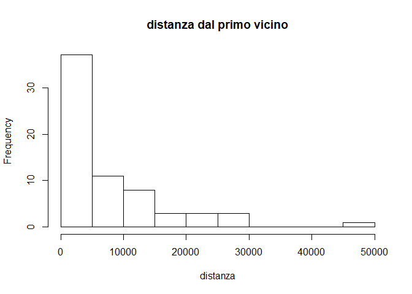
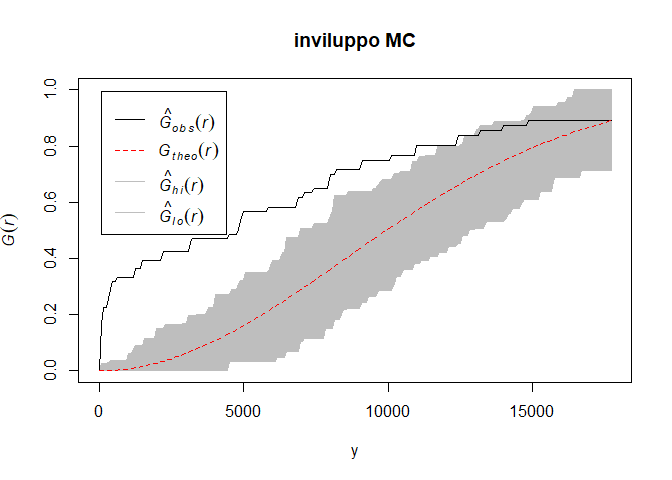

# Laboratorio 1


Librerie necessarie all'analisi:


```r
require(maptools)
require(rgdal)
```

I cinque file dbf, sbn, sbx, shp, shx servono a produrre la mappa su R, ma soltanto dbf shp e shx sono essenziali. 


```r
lomb.poly <- readOGR("lombardia.shp", verbose=T)
```

```
## OGR data source with driver: ESRI Shapefile 
## Source: "C:\Users\fabio\Documents\github repos\statistica-spaziale\laboratorio_1\lombardia.shp", layer: "lombardia"
## with 1 features
## It has 7 fields
## Integer64 fields read as strings:  COM_ COM_ID
```

```r
plot(lomb.poly)
```

<!-- -->

Lettura dati:


```r
inc = incendi <- read.table("Incendi_2003.csv", header=T,sep=";")
str(incendi)
```

```
## 'data.frame':	380 obs. of  3 variables:
##  $ Ettari: num  9 0.1 2 0.1 0.2 2 1.15 0.05 0.02 3 ...
##  $ Nord  : int  5076900 5098880 5090650 5083300 5083300 5075000 5075200 5114790 5116640 4952750 ...
##  $ EstN  : int  1604750 1518920 1508800 1491200 1491300 1563520 1638900 1601120 1603410 1524300 ...
```

Le coordinate sono espresse in Gauss-Boaga.

Abbiamo 380 osservazioni


```r
plot(lomb.poly)
points(incendi$EstN,incendi$Nord)
```

<!-- -->

## Dati areali


```r
aus.poly <- readShapePoly("austrianuts3.shp", IDvar="ID",verbose=TRUE)
```

```
## Warning: readShapePoly is deprecated; use rgdal::readOGR or sf::st_read
```

```
## Shapefile type: Polygon, (5), # of Shapes: 35
```

```r
plot(aus.poly,col = "green",border="red")
```

<!-- -->

35 province austria codificate con 35 poligoni: shape di tipo poligonali


```r
slotNames(aus.poly)
```

```
## [1] "data"        "polygons"    "plotOrder"   "bbox"        "proj4string"
```

Questi slot contengono tutta l'informazione contenuta in tutto lo shape file. 

* data: Per accedere a data si può usare equivalentemente `slot(aus.poly, "data")` e `aus.poly@data`. 

*  polygons:


```r
a = slot(aus.poly, "polygons")
length(a)
```

```
## [1] 35
```

Ognuno dei 35 elementi contiene tanta informazione. L'elemento più importante è coords ovvero coordinate lat e long di 335 punti, ovvero i punti che sono identificati sul bordo del confine di quel poligono che servono a rappresentare appunto il poligono. La geocodifica avviene tramite coordinate angolari.


```r
centr=coordinates(aus.poly)
```

`centr` (ossia centroide) è una matrice di 35 righe e 2 colonne (lat e long). Ogni riga è un'area, una provincia diversa.
 

```r
plot(aus.poly,col = "green",border="red")
points(incendi$EstN,incendi$Nord)
points(centr,col="red")
text(centr[,1],centr[,2],aus.poly$ID,col="blue")
```

<!-- -->


Per estrarre un pezzo dello shape:


```r
xx<-aus.poly[aus.poly$ID=="AT13",] # Vienna
plot(xx)
```

<!-- -->


## Processi di punto


```r
require(spatstat)
```


```r
ppp<-incendi[,c("EstN","Nord")]
ppp0=as.ppp(ppp,W=lomb.poly);ppp0 ##informazione combinata
```

```
## Warning: data contain duplicated points
```

```
## Planar point pattern: 380 points
## window: polygonal boundary
## enclosing rectangle: [1460708, 1691467] x [4947383, 5165460] units
```

```r
plot(ppp0,cex=0.5,main=,"Incendi in Lombardia nel 2003")
```

<!-- -->

Processi con marcature (mark = estensione incendio)


```r
ppp<-incendi[,c("EstN","Nord","Ettari")] # disposizione fissa
ppp0=as.ppp(ppp,W=lomb.poly,mark=ppp$Ettari);ppp0
```

```
## Warning: data contain duplicated points
```

```
## Marked planar point pattern: 380 points
## marks are numeric, of storage type  'double'
## window: polygonal boundary
## enclosing rectangle: [1460708, 1691467] x [4947383, 5165460] units
```

```r
plot(ppp0,main=,"Incendi in Lombardia nel 2003 differenziati per estensione")
```

<!-- -->

## TEST CSR


```r
d<-read.table("WLR300.txt",header=T) 
str(d)				
```

```
## 'data.frame':	66 obs. of  2 variables:
##  $ X: int  -6064 -2785 -5827 -5978 -11416 -3581 -1636 27189 14599 30251 ...
##  $ Y: int  1663 7358 6091 7326 -10350 15263 17727 965 24172 -5110 ...
```

Test per vedere se è CSR.

W = finestra; Supporto = cerchio di raggio 960550 micron, circa 10 cm di raggio; disc = funzione di questa libreria che permette di costruire palle d-dimensionali.


```r
 W <- disc(96950, c(0,0))	# finestra circolare in 0,0 = centro del wafer
pp<-ppp(d$X,d$Y,window=W); summary(pp)
```

```
## Planar point pattern:  66 points
## Average intensity 2.236005e-09 points per square unit
## 
## Coordinates are integers
## i.e. rounded to the nearest unit
## 
## Window: polygonal boundary
## single connected closed polygon with 128 vertices
## enclosing rectangle: [-96950, 96950] x [-96950, 96950] units
## Window area = 29516900000 square units
## Fraction of frame area: 0.785
```

Sommario: 66 punti; 

average intensity = #Eventi / Area Supporto = stima del parametro lambda **SE il processo fosse omogeneo**

Single connected closed polygon = approssima il cerchio con una superficie di 128 vertici 


```r
plot(pp,cex=0.6,main="locazioni eventi",cex.main =1.2,lwd=3)
```

<!-- -->

### Test basato sul quadrat counts 


```r
qx<-quadratcount(pp,4,4)	### tabella 4x4
plot(qx)
```

<!-- -->

Con quadratcounts partiziono le aree del cerchio in cellettine e conto quanti eventi trovo in quell'area. 

quadratcounts(oggettoppp, #celleascisse, #celle ordinata)

Per produrre il test basato sul chi quadro: 


```r
te0<-quadrat.test(pp,4); te0
```

```
## Warning: Some expected counts are small; chi^2 approximation may be
## inaccurate
```

```
## 
## 	Chi-squared test of CSR using quadrat counts
## 	Pearson X2 statistic
## 
## data:  pp
## X2 = 53.781, df = 15, p-value = 5.715e-06
## alternative hypothesis: two.sided
## 
## Quadrats: 16 tiles (irregular windows)
```

DF = 16 celle - 1 = 15

Test BILATERALE di RIFIUTO: pvalue molto piccolo --> HP di CSR non sembra valida


```r
plot(te0, col="red", cex=1, lty=1.5, lwd=3,bg = gray(0.7))
```

<!-- -->

Informazione osservata = in alto a sx.

Informazione attesa = in alto a dx

Valore in basso = residuo di Pearson = (exp-obs)/exp


```r
plot(te0, col="red", cex=1, lty=1.5, lwd=3,bg = gray(0.7))
plot(pp, pch="+", cols="green", cex=1.5, lwd=1.2,add=T)
```

<!-- -->

Rifare con 10x10 celle:

```r
qx10<-quadratcount(pp,10,10)	### tabella 10x10
plot(qx10)
```

<!-- -->

```r
te10 <- quadrat.test(pp,10)	###test dispersione per 10x10
```

```
## Warning: Some expected counts are small; chi^2 approximation may be
## inaccurate
```

```r
te10
```

```
## 
## 	Chi-squared test of CSR using quadrat counts
## 	Pearson X2 statistic
## 
## data:  pp
## X2 = 262.56, df = 87, p-value < 2.2e-16
## alternative hypothesis: two.sided
## 
## Quadrats: 88 tiles (irregular windows)
```

Respingo ancora hp nulla. Il numero di eventi è troppo basso rispetto al numero di celle implementate --> Warning.

### Test non quadrat counts

Valutare presenza di clustering.

Distanza dal primo vicino:


```r
hist(nndist(pp),main="distanza dal primo vicino",xlab="distanza")
```

<!-- -->

Coda sinistra molto alta --> ci aspettiamo ci sia cluster

**Test basato sulla distribuzione del NN**:

Creiamo un oggetto GGb che poi plotteremo. il test si basa sulla distribuzione empirica vs teorica


```r
GGb<-Gest(pp, r=NULL, breaks=NULL,correction="none")
plot(GGb, raw ~ r,main="FR della distanza dal primo vicino",xlab="r")
plot(GGb, theo~ r,add=T,col=2,lty=3)
legend(25000, 0.2,  legend=c("F.R. empirica","F.R. teorica"),lty=c(1,3), col=c(1,2),bty="n")
```

<!-- -->

**Inviluppo** Montecarlo per test CSR

Simulo 100 volte MC, calcolo min e max in ogni punto per creare la griglia


```r
envpp<-envelope(pp,fun=Gest,nsim=100,nrank=,verbose=TRUE,saveall=F)
```

```
## Generating 100 simulations of CSR  ...
## 1, 2, 3, 4, 5, 6, 7, 8, 9, 10, 11, 12, 13, 14, 15, 16, 17, 18, 19, 20, 21, 22, 23, 24, 25, 26, 27, 28, 29, 30, 31, 32, 33, 34, 35, 36, 37, 38,
## 39, 40, 41, 42, 43, 44, 45, 46, 47, 48, 49, 50, 51, 52, 53, 54, 55, 56, 57, 58, 59, 60, 61, 62, 63, 64, 65, 66, 67, 68, 69, 70, 71, 72, 73, 74, 75, 76,
## 77, 78, 79, 80, 81, 82, 83, 84, 85, 86, 87, 88, 89, 90, 91, 92, 93, 94, 95, 96, 97, 98, 99,  100.
## 
## Done.
```

```r
a = plot(envpp,main="inviluppo MC",xlab="y")
```

<!-- -->

```r
a
```

```
##      lty col  key                  label
## obs    1   1  obs italic(hat(G)[obs](r))
## theo   2   2 theo     italic(G[theo](r))
## hi     1   8   hi  italic(hat(G)[hi](r))
## lo     1   8   lo  italic(hat(G)[lo](r))
##                                                meaning
## obs            observed value of G(r) for data pattern
## theo                 theoretical value of G(r) for CSR
## hi   upper pointwise envelope of G(r) from simulations
## lo   lower pointwise envelope of G(r) from simulations
```


## Stima kernel intensità 


```r
Z <- density.ppp(pp, 15000)
plot(Z,main="mappa dell'intensità kernel"); 
plot(pp,add=T,cex=0.6,col="black")
```

<!-- -->

```r
persp(Z) 
```

<!-- -->

Sulla Lombardia:


```r
lomb.poly<-readShapePoly("lombardia.shp",verbose=TRUE)
```

```
## Warning: readShapePoly is deprecated; use rgdal::readOGR or sf::st_read
```

```
## Shapefile type: Polygon, (5), # of Shapes: 1
```

```r
ppp=incendi[,c("EstN","Nord")]
ppp0=as.ppp(ppp,W=lomb.poly);ppp0
```

```
## Warning: data contain duplicated points
```

```
## Planar point pattern: 380 points
## window: polygonal boundary
## enclosing rectangle: [1460708, 1691467] x [4947383, 5165460] units
```

```r
plot(ppp0,cex=0.5,main=,"Incendi in Lombardia nel 2003")
```

<!-- -->

Stima dell'intensità:


```r
Z <- density.ppp(ppp0, varcov=diag( c(var(ppp$EstN),var(ppp$Nord))/16)) 
plot(Z,main="mappa dell'intensità kernel"); 
plot(ppp0,add=T,cex=0.4)
```

<!-- -->

Rispetto a prima ho cambiato il parametro di lisciamento:


```r
varcov=diag( c(var(ppp$EstN),var(ppp$Nord))/16); varcov
```

```
##           [,1]      [,2]
## [1,] 134128703         0
## [2,]         0 103567809
```

Sto passando una matrice di varianze covarianze , con parametri di lisciamento proporzionali alla variabilità della componente. Compenso la variabilità nelle direzioni varie con un parametro di lisciamento pià elevato. 

Il /16 serve per aggiustare empiricamente la mappa;

Per scegliere h si potrebbero avere delle funzioni che cross validando trovano l'h, il problema è che tendono ad essere "troppo locali".
