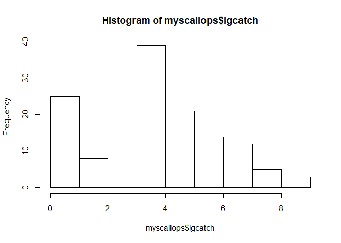
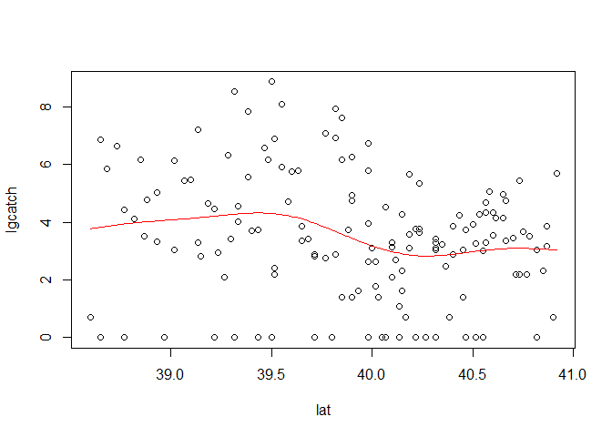
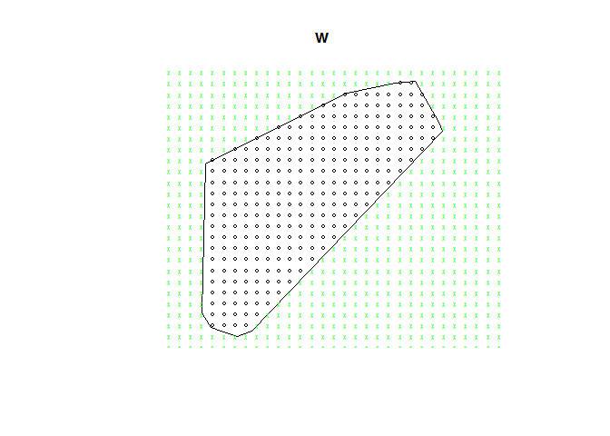

## Lettura, preparazione ed esplorazione "non spaziale" dei dati


```r
myscallops <- read.table("scallops.txt", header=T)	
dim(myscallops) 	  # numero di osservazioni e variabili 
```

```
## [1] 148   7
```

```r
myscallops[1:5,]	  # prime 5 righe del dataset
```

```
##   strata sample      lat      long tcatch prerec recruits
## 1   6350      1 40.55000 -71.55000      0      0        0
## 2   6350      2 40.46667 -71.51667      0      0        0
## 3   6350      3 40.51667 -71.71667      0      0        0
## 4   6350      4 40.38333 -71.85000      1      0        1
## 5   6350      5 40.31667 -71.78333      0      0        0
```

```r
str(myscallops)		  # descrizione sintetica dataset
```

```
## 'data.frame':	148 obs. of  7 variables:
##  $ strata  : int  6350 6350 6350 6350 6350 6350 6310 6310 6310 6310 ...
##  $ sample  : int  1 2 3 4 5 6 7 8 9 10 ...
##  $ lat     : num  40.5 40.5 40.5 40.4 40.3 ...
##  $ long    : num  -71.5 -71.5 -71.7 -71.8 -71.8 ...
##  $ tcatch  : int  0 0 0 1 0 0 2 0 7 13 ...
##  $ prerec  : int  0 0 0 0 0 0 1 0 3 6 ...
##  $ recruits: int  0 0 0 1 0 0 1 0 4 7 ...
```

Descrizione dati


```r
summary(myscallops)	
```

```
##      strata         sample           lat             long       
##  Min.   :6220   Min.   :  1.0   Min.   :38.60   Min.   :-73.70  
##  1st Qu.:6260   1st Qu.:106.8   1st Qu.:39.46   1st Qu.:-73.14  
##  Median :6290   Median :147.0   Median :39.98   Median :-72.74  
##  Mean   :6288   Mean   :131.8   Mean   :39.91   Mean   :-72.72  
##  3rd Qu.:6310   3rd Qu.:185.2   3rd Qu.:40.41   3rd Qu.:-72.31  
##  Max.   :6350   Max.   :224.0   Max.   :40.92   Max.   :-71.52  
##      tcatch           prerec           recruits      
##  Min.   :   0.0   Min.   :   0.00   Min.   :   0.00  
##  1st Qu.:   8.0   1st Qu.:   1.00   1st Qu.:   5.00  
##  Median :  30.0   Median :   8.00   Median :  21.50  
##  Mean   : 274.6   Mean   : 156.55   Mean   : 118.06  
##  3rd Qu.: 115.2   3rd Qu.:  48.25   3rd Qu.:  73.75  
##  Max.   :7084.0   Max.   :4487.00   Max.   :2597.00
```

Istogramma


```r
hist(myscallops$tcatch,main="Istogramma scallops data",xlab="numero",ylab="frequenza")
```

<!-- -->

Trasformazione di variabili


```r
myscallops[,"lgcatch"] <- log(myscallops$tcatch+1)
summary(myscallops$lgcatch)						
```

```
##    Min. 1st Qu.  Median    Mean 3rd Qu.    Max. 
##   0.000   2.197   3.434   3.483   4.756   8.866
```

```r
hist(myscallops$lgcatch)
```

<!-- -->

## Esplorazione "spaziale" dei dati


```r
plot(myscallops$long, myscallops$lat,xlab="longitudine", ylab="latitudine")
```

<!-- -->

Libreria "maps":


```r
library(maps)					# carica libreria per mappe
map("usa")						# mappa degli USA- data set in R
```

<!-- -->

```r
map("usa",fill=T,col=3, xlim=c(-78,-65), ylim=c(38.2,41.5))
points(myscallops$long, myscallops$lat,cex=0.8)	# aggiunge punti
```

<!-- -->

Libreria "spatstat":


```r
library(spatstat)
```

```
## Loading required package: spatstat.data
```

```
## Loading required package: nlme
```

```
## Loading required package: rpart
```

```
## 
## spatstat 1.59-0       (nickname: 'J'ai omis les oeufs de caille') 
## For an introduction to spatstat, type 'beginner'
```

```
## 
## Note: R version 3.4.4 (2018-03-15) is more than 9 months old; we strongly recommend upgrading to the latest version
```

```r
celle=4	
w<-convexhull.xy(x=myscallops$long,y=myscallops$lat)	# involucro convesso 
X<-ppp(myscallops$long,myscallops$lat,window=w)		    # oggetto point pattern 
plot(X,w,main="")
map("usa",fill=T,col=3, xlim=c(-78,-65), ylim=c(38.2,41.5),add=T)
qx<-quadratcount(X,celle,celle)	### tabella size x size
plot(qx,add=T)
```

<!-- -->

Statistiche locali


```r
temp=data.frame(tcatch=myscallops$tcatch,
	  lgcatch=myscallops$lgcatch,
	  xclass=cut(myscallops$long,celle),
	  yclass=cut(myscallops$lat,celle),
	  conta=rep(1,length(myscallops$lgcatch))
	  )

m<-data.frame(
  media=as.vector(tapply(temp$lgcatch, INDEX=list(temp$xclass,temp$yclass),FUN="mean")),
  varianza=as.vector(tapply(temp$lgcatch, INDEX=list(temp$xclass,temp$yclass),FUN="var")),
  frequenza=as.vector(tapply(temp$conta, INDEX=list(temp$xclass,temp$yclass),FUN="sum"))
  )

m
```

```
##       media    varianza frequenza
## 1  3.886095  4.58809839        17
## 2  4.691872 10.30794243         4
## 3        NA          NA        NA
## 4        NA          NA        NA
## 5  3.467926  0.29295695         3
## 6  4.371972  6.45877485        30
## 7  0.000000          NA         1
## 8        NA          NA        NA
## 9  1.705076  2.35932631        14
## 10 3.652081  3.86154351        17
## 11 4.165445  4.56553525        18
## 12 0.000000  0.00000000         2
## 13       NA          NA        NA
## 14 3.074234  0.06761076         2
## 15 3.440629  1.78130086        22
## 16 2.569855  3.34954120        18
```

```r
plot(varianza~media,m); abline(lm(varianza~media,m),col=2)
```

<!-- -->

```r
plot(m$varianza,ylab="varianza"); abline(h=var(temp$lgcatch),col=2)
```

<!-- -->

## Esplorazione per la stazionarietà di larga scala (in media)


```r
plot(lgcatch~lat,data=myscallops, ylab="trasformata conteggi",xlab="latitudine")
```

<!-- -->

```r
plot(lgcatch~long,data=myscallops, ylab="trasformata conteggi",xlab="longitudine")
```

<!-- -->

Linea di tendenza via kernel:


```r
with(myscallops, {
    plot(lat, lgcatch)
    lines(ksmooth(lat,  lgcatch, "normal", bandwidth=sd(myscallops$lat)),  col=2)
    plot(long, lgcatch)
    lines(ksmooth(long, lgcatch, "normal", bandwidth=sd(myscallops$long)), col=2)
    })
```

<!-- --><!-- -->

Analisi 3D:


```r
require(scatterplot3d)
```

```
## Loading required package: scatterplot3d
```


```r
s3d<-scatterplot3d(myscallops$long, myscallops$lat, myscallops$lgcatch,
	                   xlab="longitudine",ylab="latitudine",zlab="log-conteggi",
                      col.grid="lightblue", pch=20,type="h")
```

<!-- -->

Con GeoR:


```r
library(geoR)		# carica il pacchetto geoR
```

```
## --------------------------------------------------------------
##  Analysis of Geostatistical Data
##  For an Introduction to geoR go to http://www.leg.ufpr.br/geoR
##  geoR version 1.7-5.2.1 (built on 2016-05-02) is now loaded
## --------------------------------------------------------------
```

```r
obj <- cbind(myscallops$long,myscallops$lat,myscallops$lgcatch)
scallops.geo <- as.geodata(obj,coords.col=1:2,data.col=3)	# converte oggetto in classe geodata

class(scallops.geo); is.list(scallops.geo); length(scallops.geo); names(scallops.geo); 
```

```
## [1] "geodata"
```

```
## [1] TRUE
```

```
## [1] 2
```

```
## $coords
## [1] "Coord1" "Coord2"
## 
## $data
## [1] "data"
```

```r
head(scallops.geo$data);  head(scallops.geo$coords)
```

```
## [1] 0.0000000 0.0000000 0.0000000 0.6931472 0.0000000 0.0000000
```

```
##         Coord1   Coord2
## [1,] -71.55000 40.55000
## [2,] -71.51667 40.46667
## [3,] -71.71667 40.51667
## [4,] -71.85000 40.38333
## [5,] -71.78333 40.31667
## [6,] -71.88333 40.26667
```

```r
points.geodata(scallops.geo,pt.divide="quintiles", col=1:5,xlim=c(-75,-71.1), ylim=c(38.2,41.5))

legend(-72.4, 39.5, pch=19, col=1:5, pt.cex=(1:5)/3,
    c("1° quintile","2° quintile","3° quintile","4° quintile","5° quintile"))
plot(w,add=T)
map("usa",fill=T,col=3, xlim=c(-78,-65), ylim=c(38.2,41.5),add=T)
```

<!-- -->

```r
plot.geodata(scallops.geo,scatter3d = FALSE)
```

<!-- -->

```r
plot.geodata(scallops.geo,scatter3d = TRUE, lowess=T)
```

<!-- -->

## Analisi esplorativa di larga scala tramite superfici 


```r
lat.lim <- range(myscallops$lat)	# calcola il range
lon.lim <- range(myscallops$lon)
y <- seq(floor(lat.lim[1]),floor(lat.lim[2])+1,by=0.1)
x <- seq(floor(lon.lim[1]),floor(lon.lim[2])+1,by=0.1)
gr<-griglia<-expand.grid(x=x,y=y); dim(griglia)
```

```
## [1] 961   2
```

```r
plot(w,xlab="longitudine",ylab="latitudine"); points(griglia)
```

<!-- -->

Si identificano i punti griglia dentro l'involucro convesso:

```r
ok <- inside.owin(griglia$x, griglia$y, w) # nodi dentro involucro
plot(w); 
points(griglia$x[ok], griglia$y[ok],cex=0.5)
points(griglia$x[!ok], griglia$y[!ok], pch="x",cex=0.5,col="green")
```

<!-- -->


```r
library(gstat)
```

```
## 
## Attaching package: 'gstat'
```

```
## The following object is masked from 'package:spatstat':
## 
##     idw
```

```r
library(maptools)
```

```
## Loading required package: sp
```

```
## Checking rgeos availability: FALSE
##  	Note: when rgeos is not available, polygon geometry 	computations in maptools depend on gpclib,
##  	which has a restricted licence. It is disabled by default;
##  	to enable gpclib, type gpclibPermit()
```

```r
locazioni=data.frame(lon=myscallops$lon,lat=myscallops$lat,lgcatch=myscallops$lgcatch)
coordinates(locazioni)=c("lon","lat")
coordinates(griglia) = ~x+y
idw.p=gstat::idw(formula=lgcatch ~ 1, locations=locazioni, newdata=griglia, 
          nmax = 15, idp = 2)
```

```
## [inverse distance weighted interpolation]
```

```r
idw.o=as.data.frame(idw.p)
names(idw.o)[1:3]<-c("long","lat","lgcatch")
idw.o[!ok,"lgcatch"] <- NA
surface<-matrix(idw.o$lgcatch,byrow=F,nrow=length(y))
int.scp <-list(x=x,y=y,z=surface) #--- lista per grafici

image(int.scp, xlab="Longitude", ylab="Latitude",xlim=c(-75.5,-71.50), ylim=c(38,42))	
contour(int.scp, add=T)
points.geodata(scallops.geo,pt.divide="quintiles", col=1:5,add=T)
map("usa", add=T, xlim=c(-74,-71), ylim=c(38.2,41.5),fill=T,col=3,	xlab="longitudine",ylab="latitudine")	
plot(w,border="gray",add=T,lwd=3)		
map("usa", add=T, xlim=c(-74,-71), ylim=c(38.2,41.5),fill=T,col=3,	xlab="longitudine",ylab="latitudine")	
```

<!-- -->

```r
persp(int.scp,xlab="longitudine",ylab="latitudine",zlab="lgcatch",
		      expand=1,theta=30,phi=20,ticktype="detailed" )		
```

<!-- -->


