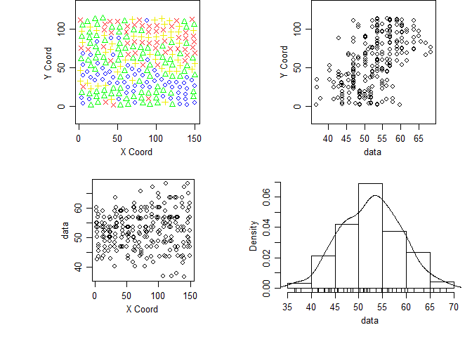
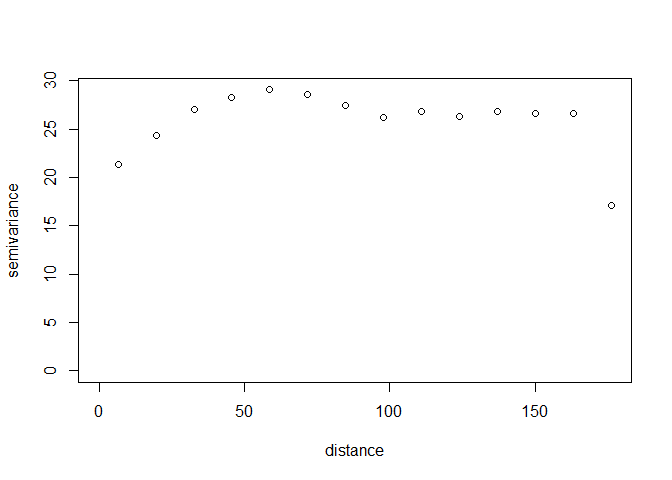
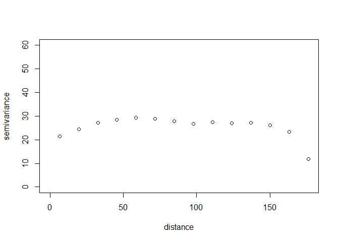
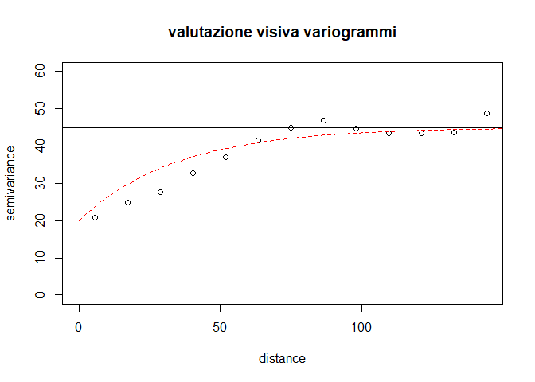
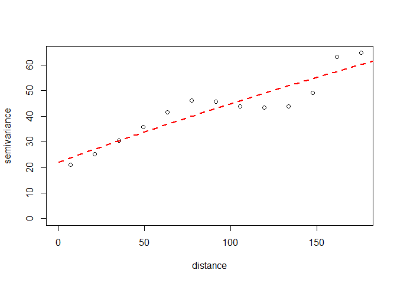
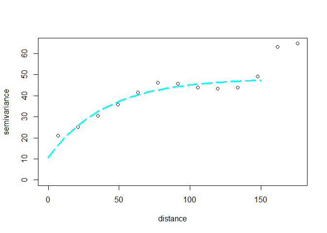
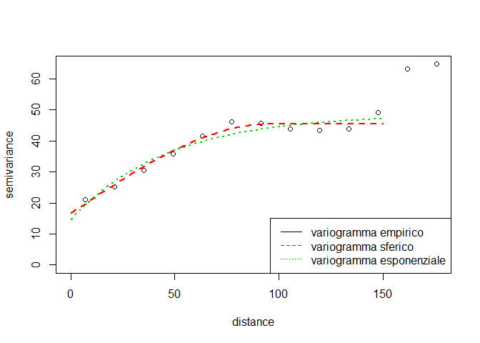

# Laboratorio 3


```r
require(geoR)
```


```r
dat.om<-soja98
str(dat.om) 		# numero di osservazioni e variabili 
```

```
## 'data.frame':	256 obs. of  10 variables:
##  $ X    : num  5.6 15.2 24.8 34.4 44 53.6 63.2 72.8 82.4 92 ...
##  $ Y    : num  3.6 1.6 4.6 5.6 1.6 1.6 2.6 4.6 3.6 2.6 ...
##  $ P    : num  4.4 3.7 3.5 3.9 3.6 3.7 2.9 2.2 3 2.7 ...
##  $ PH   : num  6.3 6.3 5.4 5.2 5.6 5.2 5.2 5.6 5.7 5.4 ...
##  $ K    : num  0.53 0.38 0.47 0.48 0.52 0.45 0.47 0.42 0.36 0.35 ...
##  $ MO   : num  47.5 48.7 51.8 57.9 59.7 ...
##  $ SB   : num  80.6 82.2 61.5 59.1 71.6 ...
##  $ iCone: num  31 29.5 23 24.5 18.5 21.5 13 23 20 20 ...
##  $ Rend : num  6.4 7.05 5.88 8.52 7.47 ...
##  $ PROD : num  2.56 2.82 2.35 3.41 2.99 3.73 2.91 3.47 3 3.58 ...
```

```r
summary(dat.om)	# descrittive per ogni variabile nel data set
```

```
##        X                Y                P                PH       
##  Min.   :  1.60   Min.   :  1.60   Min.   : 2.000   Min.   :4.200  
##  1st Qu.: 38.60   1st Qu.: 29.60   1st Qu.: 3.100   1st Qu.:4.800  
##  Median : 75.60   Median : 57.60   Median : 3.800   Median :5.100  
##  Mean   : 75.85   Mean   : 57.29   Mean   : 4.031   Mean   :5.112  
##  3rd Qu.:112.60   3rd Qu.: 85.60   3rd Qu.: 4.500   3rd Qu.:5.400  
##  Max.   :149.60   Max.   :113.60   Max.   :13.100   Max.   :6.600  
##        K                MO              SB            iCone      
##  Min.   :0.1700   Min.   :36.55   Min.   :14.89   Min.   :10.00  
##  1st Qu.:0.2675   1st Qu.:48.07   1st Qu.:46.08   1st Qu.:17.50  
##  Median :0.3150   Median :53.61   Median :55.36   Median :20.50  
##  Mean   :0.3301   Mean   :52.55   Mean   :54.85   Mean   :20.54  
##  3rd Qu.:0.3800   3rd Qu.:56.97   3rd Qu.:63.11   3rd Qu.:23.00  
##  Max.   :0.7400   Max.   :68.35   Max.   :84.03   Max.   :32.50  
##       Rend             PROD      
##  Min.   : 2.974   Min.   :1.190  
##  1st Qu.: 6.024   1st Qu.:2.408  
##  Median : 6.817   Median :2.725  
##  Mean   : 6.866   Mean   :2.746  
##  3rd Qu.: 7.613   3rd Qu.:3.042  
##  Max.   :10.356   Max.   :4.140
```

```r
d1<-obj <- dat.om[,c("X","Y","MO")];	summary(obj)
```

```
##        X                Y                MO       
##  Min.   :  1.60   Min.   :  1.60   Min.   :36.55  
##  1st Qu.: 38.60   1st Qu.: 29.60   1st Qu.:48.07  
##  Median : 75.60   Median : 57.60   Median :53.61  
##  Mean   : 75.85   Mean   : 57.29   Mean   :52.55  
##  3rd Qu.:112.60   3rd Qu.: 85.60   3rd Qu.:56.97  
##  Max.   :149.60   Max.   :113.60   Max.   :68.35
```

La variabile MO ha un campo di variazione limitato, con moda e mediana vicini, si può supporre simmetria e non sembrano esserci outliers.

Preparazione dati per GeoR:


```r
dat.om.geo <- as.geodata(obj,coords.col=1:2,data.col=3)		# converte oggetto in classe geodata
plot(dat.om.geo)
```

<!-- -->

Risulta una tendenza da sud a nord che aumenta la concentrazione. Potrebbe esserci componente di larga scala, anisotropia.

## Analisi variabilità di piccola scala

**Nuvola del variogramma**


```r
plot(variog(dat.om.geo, estimator.type="classical",option="cloud"),cex=0.4)
```

```
## variog: computing omnidirectional variogram
```

<!-- -->

In ascissa stiamo plottando le distanze, in ordinata la differenza tra le Y. 

Non ci dà particolari informazioni, vediamo solo che cresce un po' aumentando la distanza. Potrebbe quindi esserci un trend.

**Variogramma empirico**


```r
dat.om.var <- variog(dat.om.geo,	estimator.type="classical", uvec=14)
```

```
## variog: computing omnidirectional variogram
```

```r
plot(dat.om.var)
```

<!-- -->

Rimuovendo l'opzione cloud, variog non calcola la nuvola, ma produce il variogramma empirico. Calcola delle bande di confidenza e plotta nelle ascisse i punti centrali delle classi e ordinate le medie delle differenze al quadrato. 


## Stima del variogramma

estimator.type = classical --> variogramma empirico;

estimator.type = modulus --> variogramma robusto;


```r
dat.om.var.robust <- variog(dat.om.geo, estimator.type="modulus",uvec=14)
```

```
## variog: computing omnidirectional variogram
```

```r
plot(dat.om.var,main="variogramma empirico",ylim=c(0,110));	
```

<!-- -->

```r
plot(dat.om.var.robust,main="variogramma robusto",ylim=c(0,110))
```

<!-- -->

I due output sono pressochè identici nel lato che ci interessa poichè non ci sono outlier evidenti.

Lisciamento kernel del variogramma:


```r
vario.s <- variog(dat.om.geo, op="sm", band=sd(dat.om.var$u)) 
```

```
## variog: computing omnidirectional variogram
```

```r
plot(vario.s,type="l",ylim=c(0,110))
points(dat.om.var$u, dat.om.var$v, col=2)	# aggiunge variogramma empirico al plot
```

<!-- -->

Ottengo un'operazione di lisciamento migliore, meno brutale rispetto a prima, ma le informazioni che ci vengono fornite sono molto simili.

Sarebbe stato meglio farlo con le sd di tutte le distanze tra tutti i punti


```r
a <- variog(dat.om.geo, estimator.type="classical",option="cloud")
```

```
## variog: computing omnidirectional variogram
```

```r
vario.a <- variog(dat.om.geo, op="sm", band=sd(a$u))
```

```
## variog: computing omnidirectional variogram
```

```r
par(mfrow=c(1,1))
plot(vario.a, type="l", ylim=c(0,80))
```

<!-- -->

Posso pensare che la soglia del variogramma sia circa 45, mentre il range potrebbe essere in corrispondenza della distanza 100.

Il nugget posso ipotizzare sia intorno a 20: il fenomeno risulta essere non molto disturbato dal rumore, infatti quasi la metà della variabilitè (20/40) è dovuta al white noise, ovvero la componente di errore.

**Variogrammi direzionali**

Come usare variog per variogrammi direzionali: 1) oggetto geodata 2) specifichiamo la direzione verso la quale vogliamo calcolare il variogramma empirico, ovvero l'angolo azimutale 3) tolleranza angolare

Scegliendo pi/8 come tolleranza impongo che ogni coppia entri in un solo variogramma direzionale.


```r
vario.0  <- variog(dat.om.geo,  dir=0,    tol=pi/8)   # sud nord 
```

```
## variog: computing variogram for direction = 0 degrees (0 radians)
##         tolerance angle = 22.5 degrees (0.393 radians)
```

```r
vario.45 <- variog(dat.om.geo,  dir=pi/4, tol=pi/8)   # sud ovest / nord est
```

```
## variog: computing variogram for direction = 45 degrees (0.785 radians)
##         tolerance angle = 22.5 degrees (0.393 radians)
```

```r
vario.90 <- variog(dat.om.geo,  dir=pi/2, tol=pi/8)   # est ovest
```

```
## variog: computing variogram for direction = 90 degrees (1.571 radians)
##         tolerance angle = 22.5 degrees (0.393 radians)
```

```r
vario.135 <- variog(dat.om.geo, dir=pi*3/4, tol=pi/8) # sud est / nord ovest 
```

```
## variog: computing variogram for direction = 135 degrees (2.356 radians)
##         tolerance angle = 22.5 degrees (0.393 radians)
```

```r
plot(c(0,180),c(0,100),type="n",xlab="distanza",ylab="semivarianza")#,type="p"
lines(dat.om.var)
lines(vario.0 , col=2,lty=2)
lines(vario.45, col=3,lty=3)
lines(vario.90, col=4,lty=4)
lines(vario.135,col=5,lty=5)
legend("topleft", cex=0.8, 
        legend=c("omnidirectional", expression(0 * degree), 
				expression(45 * degree), expression(90 * degree), 
				expression(135 * degree)), lty=c(1:5),col=1:5)
```

<!-- -->

Le stime nei variogrammi sono molto più variabili, in quanto la numerositè è molto più bassa.

Tutti i variog direzionali tranne quello blu, presentano una crescita con l'aumentare della distanza.

Questo vuol dire che molto probabilmente sussiste un trend, di direzione nord sud (come si era visto sopra in un altro grafico).

Il variog rosso decresce. Questo può essere dato da una numerositè molto bassa negli ultimi bin. 

Per vedere il processo al netto del trend si può osservare il variogramma direzionale est-overt (ortogonale al trend!).

Un modo per trattare il trend è il seguente: 

* stimo componente di larga scala OLS (polinomio max 3 grado)
* tolgo componente di larga scala
* stimo variogramma empirico sui residui della regressione senza larga scala

**Stima variogramma con trend**


```r
dat.om.var.notr <- variog(dat.om.geo,trend ="1st", estimator.type="classical", uvec=14)	
```

```
## variog: computing omnidirectional variogram
```

```r
plot(dat.om.var.notr)
```

<!-- -->

Detrend fatto a mano:


```r
plot(variog(
		as.geodata(obj=data.frame(obj[,1:2],res=residuals(lm(obj$MO~obj$Y))),
		coords.col=1:2,data.col=3),uvec=14
		),ylim=c(0,60))
```

```
## variog: computing omnidirectional variogram
```

<!-- -->

`res=residuals(lm(obj$MO~obj$Y)))` --> dati su cui faccio il variogramma, prendo i residui di una regressione lineare in direzione Y, l'unica dove ho visto esserci un trend.

`obj[,1,2]` --> prendo le prime due colonne, le coordinate, e ci aggiungo `res`, che è la variabile risposta del variog.

**Esercizio** Detrendizzare manualmente i dati con un trend di primo grado in X e Y e costruire il variog dei residui 


```r
plot(variog(as.geodata(obj=data.frame(obj[,1:2],res=residuals(lm(obj$MO~obj$Y+obj$X))),
                       coords.col=1:2,data.col=3), uvec=20),ylim=c(0,60))
```

```
## variog: computing omnidirectional variogram
```

<!-- -->

Detrendizzando rispetto a tutte e due le coordinate viene uguale perchè X non è significativa:


```r
summary(lm(obj$MO~obj$Y+obj$X))
```

```
## 
## Call:
## lm(formula = obj$MO ~ obj$Y + obj$X)
## 
## Residuals:
##      Min       1Q   Median       3Q      Max 
## -13.7121  -3.5400   0.2586   3.2852  14.0050 
## 
## Coefficients:
##              Estimate Std. Error t value Pr(>|t|)    
## (Intercept) 45.670823   0.863047  52.918   <2e-16 ***
## obj$Y        0.103410   0.009855  10.493   <2e-16 ***
## obj$X        0.012537   0.007393   1.696   0.0912 .  
## ---
## Signif. codes:  0 '***' 0.001 '**' 0.01 '*' 0.05 '.' 0.1 ' ' 1
## 
## Residual standard error: 5.238 on 253 degrees of freedom
## Multiple R-squared:  0.3082,	Adjusted R-squared:  0.3028 
## F-statistic: 56.37 on 2 and 253 DF,  p-value: < 2.2e-16
```

Sussiste infatti anisotropia e un trend verticale in Y.

Direzionali detrendizzati:


```r
 date.om.geo.det = as.geodata(obj=data.frame(obj[,1:2],res=residuals(lm(obj$MO~obj$Y+obj$X))))
  vario.0  <- variog(date.om.geo.det,  dir=0,    tol=pi/8) ##var empirico in direzione sud nord
```

```
## variog: computing variogram for direction = 0 degrees (0 radians)
##         tolerance angle = 22.5 degrees (0.393 radians)
```

```r
  vario.45 <- variog(date.om.geo.det,  dir=pi/4, tol=pi/8) #sud ovest --> nord est
```

```
## variog: computing variogram for direction = 45 degrees (0.785 radians)
##         tolerance angle = 22.5 degrees (0.393 radians)
```

```r
  vario.90 <- variog(date.om.geo.det,  dir=pi/2, tol=pi/8)
```

```
## variog: computing variogram for direction = 90 degrees (1.571 radians)
##         tolerance angle = 22.5 degrees (0.393 radians)
```

```r
  vario.135 <- variog(date.om.geo.det, dir=pi*3/4, tol=pi/8)
```

```
## variog: computing variogram for direction = 135 degrees (2.356 radians)
##         tolerance angle = 22.5 degrees (0.393 radians)
```

```r
  dat.om.var.det <- variog(date.om.geo.det,	estimator.type="classical", uvec=14)
```

```
## variog: computing omnidirectional variogram
```

```r
plot(c(0,180),c(0,100),type="n",xlab="distanza",ylab="semivarianza", 
       main="Variogrammi dei residui")#,type="p"
  lines(dat.om.var.det) #omnidir
  lines(vario.0 , col=2,lty=2)
  lines(vario.45, col=3,lty=3)
  lines(vario.90, col=4,lty=4)
  lines(vario.135,col=5,lty=5)
  legend("topleft", cex=0.8, 
         legend=c("omnidirectional", expression(0 * degree), 
                  expression(45 * degree), expression(90 * degree), 
                  expression(135 * degree)), lty=c(1:5),col=1:5)
```

<!-- -->


## Stima parametrica del variogramma tramite LS

setto la massima distanza pari a 150 per togliere distanze poco significative


```r
max.dist <- 150
dat.om.var <- variog(dat.om.geo, estimator.type="classical",max.dist=max.dist)	# variogramma empirico
```

```
## variog: computing omnidirectional variogram
```

Sovrapponiamo un modello  teorico al variog empirico


```r
plot(dat.om.var, main="valutazione visiva variogrammi", ylim=c(0,60))
lines.variomodel(cov.model = "exp", cov.pars = c(25,35), nug =20,  
          max.dist=max.dist,col=2,lty=2)
abline(h=45)
```

<!-- -->

0.95*soglia = secondo elemento di cov.pars perchè la soglia è un asintoto orizzontale, in questo caso il range

NB: io specifico come primo parametro di cov.pars la soglia parziale. quindi soglia effettiva = parziale + nugget = 45

Un modello di questo tipo interpola ragionevolmente bene il variogramma empirico, il quale sembra essere una stima attendibile del variog teorico.

**Esercizio**. Aggiungere al grafico precedente il variog esponenziale con soglia 35 e 45. Replicare l'esercizio con funzioni di variogramma diverse: sferico e wave


```r
plot(dat.om.var, main="valutazione visiva variogrammi", ylim=c(0,60))
lines.variomodel(cov.model = "exp", cov.pars = c(25,35), nug =20,  
          max.dist=max.dist,col=2,lty=2)
abline(h=45)

lines.variomodel(cov.model = "exp", cov.pars = c(35,45), nug =20,  ##con cov.model, gli dico quale variogramma
	                   #voglio implementare
	                   max.dist=max.dist,col=3,lty=3) 
lines.variomodel(cov.model = "wave", cov.pars = c(25,35), nug =20,  
                 max.dist=max.dist,col=4,lty=4)
lines.variomodel(cov.model = "spherical", cov.pars = c(25,35), nug =20,  
                 max.dist=max.dist,col=5,lty=5)
legend("bottomright", cex=0.8, 
       legend=c("variogramma empirico", "variogramma teorico exp 1",
                "variogramma teorico exp 2", "var wave", "var sferico"), lty=c(1:5),col=1:5)
```

<!-- -->


### Metodo WLS

Funzione variofit: richiede 1) variogramma empirico 2) valori di inizializzazione per LS 3) `fix.nugget` = False


```r
dat.om.var.fit <- variofit(dat.om.var,ini.cov.pars=c(25,35),
		    cov.model="exponential", fix.nugget=FALSE, nugget=20)
```

```
## variofit: covariance model used is exponential 
## variofit: weights used: npairs 
## variofit: minimisation function used: optim
```

```r
summary(dat.om.var.fit)
```

```
## $pmethod
## [1] "WLS (weighted least squares)"
## 
## $cov.model
## [1] "exponential"
## 
## $spatial.component
##  sigmasq      phi 
## 36.68186 41.66799 
## 
## $spatial.component.extra
## kappa 
##   0.5 
## 
## $nugget.component
##    tausq 
## 11.73473 
## 
## $fix.nugget
## [1] FALSE
## 
## $fix.kappa
## [1] TRUE
## 
## $practicalRange
## [1] 124.8261
## 
## $sum.of.squares
##    value 
## 142121.7 
## 
## $estimated.pars
##    tausq  sigmasq      phi 
## 11.73473 36.68186 41.66799 
## 
## $weights
## [1] "npairs"
## 
## $call
## variofit(vario = dat.om.var, ini.cov.pars = c(25, 35), cov.model = "exponential", 
##     fix.nugget = FALSE, nugget = 20)
## 
## attr(,"class")
## [1] "summary.variomodel"
```

`spatial.component` = stime per soglia parziale e range

`nugget.component` = stima per il nugget

`practicalRange` = stima del range quando la soglia è asintotica = 0.95*soglia


```r
dat.om.var.fit$cov.pars  # stima di  soglia parziale e range 
```

```
## [1] 36.68186 41.66799
```

```r
dat.om.var.fit$nugget    # stima del nugget
```

```
## [1] 11.73473
```

```r
dat.om.var.fit$value     # somma dei quadrati
```

```
## [1] 142121.7
```


Confronto grafico tra i variogrammi parametrici stimati e il variogramma empirico 

Effetto ponderazione e massima distanza

1) Variogramma empirico


```r
dat.om.var <- variog(dat.om.geo, estimator.type="classical")	     # variogramma empirico
```

```
## variog: computing omnidirectional variogram
```

```r
plot(dat.om.var)
```

<!-- -->

2) OLS


```r
dat.om.var.fit.ols <- variofit(dat.om.var,
	  	ini.cov.pars=c(25,35),
		  cov.model="exponential", fix.nugget=FALSE,nugget=20,weights = "equal" )
```

```
## variofit: covariance model used is exponential 
## variofit: weights used: equal 
## variofit: minimisation function used: optim
```

```r
  ##se metto weights=equal---> WLS collassa a OLS
plot(dat.om.var)
lines(dat.om.var.fit.ols,col=2, lty=2, lwd=2)
```

<!-- -->

3) WLS con npairs come peso


```r
dat.om.var.fit.wls <- variofit(dat.om.var,
	  	ini.cov.pars=c(25,35),
		  cov.model="exponential", fix.nugget=FALSE,nugget=20)
```

```
## variofit: covariance model used is exponential 
## variofit: weights used: npairs 
## variofit: minimisation function used: optim
```

```r
plot(dat.om.var)
lines(dat.om.var.fit.wls,col=3, lty=3, lwd=3)
```

<!-- -->

4) OLS con max.dist = 150


```r
dat.om.var.fit.ols.MD<- variofit(dat.om.var, ini.cov.pars=c(25,35), 
	  		cov.model="exponential", fix.nugget=FALSE,nugget=20, 
		  	weights="equal", max.dist=max.dist)
```

```
## variofit: covariance model used is exponential 
## variofit: weights used: equal 
## variofit: minimisation function used: optim
```

```r
plot(dat.om.var)
lines(dat.om.var.fit.ols.MD,col=4, lty=4, lwd=2)
```

<!-- -->

5) OLS con max.dist = 150


```r
dat.om.var.fit.wls.MD<- variofit(dat.om.var, ini.cov.pars=c(25,35), 
			cov.model="exponential", fix.nugget=FALSE,nugget=20, 
			max.dist=max.dist)
```

```
## variofit: covariance model used is exponential 
## variofit: weights used: npairs 
## variofit: minimisation function used: optim
```

```r
plot(dat.om.var)
lines(dat.om.var.fit.wls.MD,col=5, lty=5,lwd=3)
```

<!-- -->

Tutto in uno:


```r
plot(dat.om.var)
lines(dat.om.var.fit.ols,col=2, lty=2, lwd=2)
lines(dat.om.var.fit.wls,col=3, lty=3, lwd=3)
lines(dat.om.var.fit.ols.MD,col=4, lty=4, lwd=2)
lines(dat.om.var.fit.wls.MD,col=5, lty=5,lwd=3)
legend(15,20,c("variogramma empirico",
				"variogramma ols - modello esponenziale",
				"variogramma wls - modello esponenziale",
				paste("variogramma ols - modello esponenziale max dist=",
				max.dist,sep=""),
				paste("variogramma wls - modello esponenziale max dist=",
				max.dist,sep="")),
				lty=1:5, col=1:5,cex=0.9,bty="n")
```

<!-- -->

Confronto tra modelli:


```r
round(rbind(
  	wls.maxdist150=summary(dat.om.var.fit.wls.MD)$estimated.pars,
	  ols.maxdist150=summary(dat.om.var.fit.ols.MD)$estimated.pars,
	  wls.maxdist=summary(dat.om.var.fit.wls)$estimated.pars,
	  ols.maxdist=summary(dat.om.var.fit.ols)$estimated.pars
	),1)
```

```
##                tausq sigmasq   phi
## wls.maxdist150  10.6    37.7  40.5
## ols.maxdist150  14.7    33.8  46.3
## wls.maxdist     11.2    37.8  42.8
## ols.maxdist     22.1   178.9 732.9
```


Stima modello sferico:


```r
dat.om.var.fit.sphe.ols <- variofit(dat.om.var,ini.cov.pars=c(35,70),
	  	cov.model="spherical", fix.nugget=FALSE, nugget=10, weights = "equal",
		  max.dist=max.dist)
```

```
## variofit: covariance model used is spherical 
## variofit: weights used: equal 
## variofit: minimisation function used: optim
```

```r
plot(dat.om.var)
lines(dat.om.var.fit.sphe.ols,lwd=2)
```

<!-- -->

Confronto tra modelli:


```r
round(
	  rbind(
		  modello.sferico=c(summary(dat.om.var.fit.sphe.ols)$estimated.pars,
		     range.effettivo=summary(dat.om.var.fit.sphe.ols)$practicalRange,
	  	   SumSquares=summary(dat.om.var.fit.sphe.ols)$sum.of.squares)
		  ,
		  modello.esponenziale=c(summary(dat.om.var.fit.ols.MD)$estimated.pars,
		     range.effettivo=summary(dat.om.var.fit.ols.MD)$practicalRange,
		     SumSquares=summary(dat.om.var.fit.ols.MD)$sum.of.squares)
	   ),
	  digits=1)
```

```
##                      tausq sigmasq  phi range.effettivo SumSquares.value
## modello.sferico       16.6    28.8 95.7            95.7             34.0
## modello.esponenziale  14.7    33.8 46.3           138.6             54.7
```


**Esercizio** riportare su uno stesso grafico i due variogrammi, sferico ed esponenziale stimati tramite ols insieme al variogramma empirico


```r
plot(dat.om.var)
	lines(dat.om.var.fit.sphe.ols,lwd=2, lty=2, col=2)
	lines(dat.om.var.fit.ols.MD,lwd=2, lty=3, col=3)
	legend("bottomright",c("variogramma empirico","variogramma sferico","variogramma esponenziale"),
	       col=c(1:3),lty=c(1:3))
```

<!-- -->

## Stima parametrica del variogramma tramite ML


```r
dat.om.lik.fit <- likfit(dat.om.geo,ini.cov.pars=c(35,46),
		cov.model="exponential",trend="cte", fix.nugget=FALSE,nugget=20,
		nospatial=FALSE,messages=T)
```

```
## kappa not used for the exponential correlation function
## ---------------------------------------------------------------
## likfit: likelihood maximisation using the function optim.
## likfit: Use control() to pass additional
##          arguments for the maximisation function.
##         For further details see documentation for optim.
## likfit: It is highly advisable to run this function several
##         times with different initial values for the parameters.
## likfit: WARNING: This step can be time demanding!
## ---------------------------------------------------------------
## likfit: end of numerical maximisation.
```

```r
print(dat.om.lik.fit)
```

```
## likfit: estimated model parameters:
##    beta   tausq sigmasq     phi 
## "52.69" "18.02" "21.48" "54.08" 
## Practical Range with cor=0.05 for asymptotic range: 161.9993
## 
## likfit: maximised log-likelihood = -774.2
```

```r
summary(dat.om.lik.fit)
```

```
## Summary of the parameter estimation
## -----------------------------------
## Estimation method: maximum likelihood 
## 
## Parameters of the mean component (trend):
##    beta 
## 52.6943 
## 
## Parameters of the spatial component:
##    correlation function: exponential
##       (estimated) variance parameter sigmasq (partial sill) =  21.48
##       (estimated) cor. fct. parameter phi (range parameter)  =  54.08
##    anisotropy parameters:
##       (fixed) anisotropy angle = 0  ( 0 degrees )
##       (fixed) anisotropy ratio = 1
## 
## Parameter of the error component:
##       (estimated) nugget =  18.02
## 
## Transformation parameter:
##       (fixed) Box-Cox parameter = 1 (no transformation)
## 
## Practical Range with cor=0.05 for asymptotic range: 161.9993
## 
## Maximised Likelihood:
##    log.L n.params      AIC      BIC 
## "-774.2"      "4"   "1556"   "1571" 
## 
## non spatial model:
##    log.L n.params      AIC      BIC 
##   "NULL"   "NULL"   "NULL"   "NULL" 
## 
## Call:
## likfit(geodata = dat.om.geo, trend = "cte", ini.cov.pars = c(35, 
##     46), fix.nugget = FALSE, nugget = 20, cov.model = "exponential", 
##     nospatial = FALSE, messages = T)
```

```r
plot(dat.om.var)
lines(dat.om.var.fit,col=2, lty=2)		# aggiunge plot stime WLS
lines(dat.om.lik.fit,col=5, lty=3)    # aggiunge plot stime ML
legend("bottomright",c("variogramma empirico","variogramma WLS","variogramma ML"),
col=c(1:3),lty=c(1:3))
```

<!-- -->


## Valutazione della variabilità del variogramma tramite MonteCarlo e test grafici via permutazione

Idea: si simulano campioni da traettorie di struttura nota, fissando i parametri del variog ai valori stimati (wls) e si calcolano i variog empirici su dati simulati

Via WLS:


```r
alpha=dat.om.var.fit.wls$nugget		      # nugget
phi<-dat.om.var.fit.wls$cov.par[2]	    # range
C0=dat.om.var.fit.wls$cov.par[1]+alpha	# soglia
```

Esempio con 4 simulazioni:


```r
set.seed(123)
n<-200		#### numero siti di "rilevazione"
m<-grf(n=n, cov.pars=dat.om.var.fit.wls$cov.par,nsim=4,nugget=alpha,xlim=c(0,150),ylim=c(0,115))
```

```
## grf: simulation(s) on randomly chosen locations with  200  points
## grf: process with  1  covariance structure(s)
## grf: nugget effect is: tausq= 11.1778182166177 
## grf: covariance model 1 is: exponential(sigmasq=37.8297299256044, phi=42.8380318563283)
## grf: decomposition algorithm used is:  cholesky 
## grf: End of simulation procedure. Number of realizations: 4
```

```r
par(mfrow=c(2,2))
for(i in 1:4){
  # ###- nuovo "campione" con autocorrelazione data
	  dat3<-data.frame(m$coords,z=m$data[,i])		       
	  dat3.geo <- as.geodata(dat3,coords.col=1:2,data.col=3) # converte oggetto in classe geodata
	  dat3.z.vario <- variog(dat3.geo, estimator.type="classical")
	  plot(dat3.z.vario)
	  lines.variomodel(cov.model = "exp", cov.pars = c(C0-alpha,phi), nug =alpha,
		  max.dist=max.dist ,col=2,lty=2)  # parametrizzazioe del covariogramma come richiesto da geoR
    }
```

```
## variog: computing omnidirectional variogram
```

```
## variog: computing omnidirectional variogram
```

```
## variog: computing omnidirectional variogram
```

```
## variog: computing omnidirectional variogram
```

<!-- -->

valutazione della variabilità del variogramma


```r
par(mfrow=c(1,1))
dat.om.env.mod <- variog.model.env(dat.om.geo, 
					obj.v = dat.om.var, model.pars =dat.om.var.fit)	#simulazione da modello
```

```
## variog.env: generating 99 simulations (with  256 points each) using the function grf
## variog.env: adding the mean or trend
## variog.env: computing the empirical variogram for the 99 simulations
## variog.env: computing the envelops
```

```r
plot(dat.om.var, env =dat.om.env.mod )
lines(dat.om.var.fit,col=2, lty=2)
```

<!-- -->

valutazione della correlazione spaziale - test grafico via permutazione


```r
dat.om.env <- variog.mc.env(dat.om.geo, obj.var = dat.om.var,save.sim=T)	
```

```
## variog.env: generating 99 simulations by permutating data values
## variog.env: computing the empirical variogram for the 99 simulations
## variog.env: computing the envelops
```

```r
  plot(dat.om.var, envelope = dat.om.env)
```

<!-- -->
