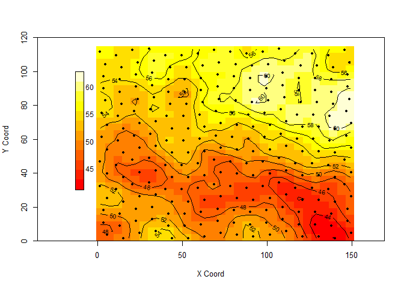
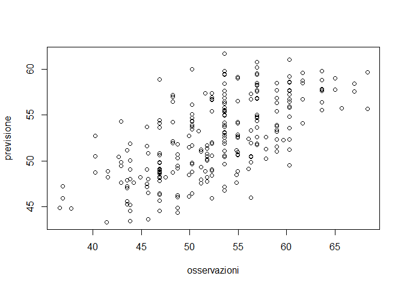
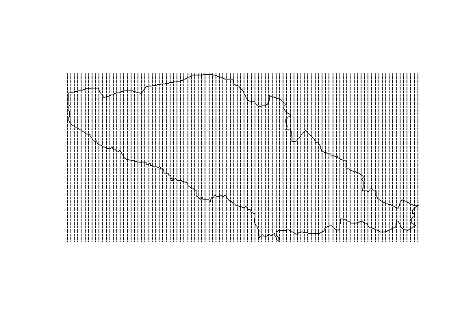

# Laboratorio 4


Lettura dati:


```r
require(geoR)			# carica il pacchetto geoR
```


```r
dat.om<-soja98; str(dat.om)
```

```
## 'data.frame':	256 obs. of  10 variables:
##  $ X    : num  5.6 15.2 24.8 34.4 44 53.6 63.2 72.8 82.4 92 ...
##  $ Y    : num  3.6 1.6 4.6 5.6 1.6 1.6 2.6 4.6 3.6 2.6 ...
##  $ P    : num  4.4 3.7 3.5 3.9 3.6 3.7 2.9 2.2 3 2.7 ...
##  $ PH   : num  6.3 6.3 5.4 5.2 5.6 5.2 5.2 5.6 5.7 5.4 ...
##  $ K    : num  0.53 0.38 0.47 0.48 0.52 0.45 0.47 0.42 0.36 0.35 ...
##  $ MO   : num  47.5 48.7 51.8 57.9 59.7 ...
##  $ SB   : num  80.6 82.2 61.5 59.1 71.6 ...
##  $ iCone: num  31 29.5 23 24.5 18.5 21.5 13 23 20 20 ...
##  $ Rend : num  6.4 7.05 5.88 8.52 7.47 ...
##  $ PROD : num  2.56 2.82 2.35 3.41 2.99 3.73 2.91 3.47 3 3.58 ...
```

```r
obj <- dat.om[,c("X","Y","MO")]
summary(obj)
```

```
##        X                Y                MO       
##  Min.   :  1.60   Min.   :  1.60   Min.   :36.55  
##  1st Qu.: 38.60   1st Qu.: 29.60   1st Qu.:48.07  
##  Median : 75.60   Median : 57.60   Median :53.61  
##  Mean   : 75.85   Mean   : 57.29   Mean   :52.55  
##  3rd Qu.:112.60   3rd Qu.: 85.60   3rd Qu.:56.97  
##  Max.   :149.60   Max.   :113.60   Max.   :68.35
```

```r
attach(obj)
```

Variogramma empirico:


```r
soja.geo <- as.geodata(obj,coords.col=1:2,data.col=3)
soja.var <- variog(soja.geo, estimator.type="classical")
```

```
## variog: computing omnidirectional variogram
```

```r
plot(soja.var, main="variogramma empirico", type="o")
```

<!-- -->

Stima variogramma con WLS:


```r
soja.var.fit <-variofit(soja.var,ini.cov.pars=c(25,35),weights="cressie",
		cov.model="exponential", fix.nugget=FALSE,nugget=20)
```

```
## variofit: covariance model used is exponential 
## variofit: weights used: cressie 
## variofit: minimisation function used: optim
```

```r
plot(soja.var, type="o")
lines(soja.var.fit)
```

<!-- -->

```r
a<-soja.var.fit$cov.pars
```

Preparazione griglia di previsione:


```r
 size=30
#seq tra min e max delle ordinate:
#creo un grigliato che copre esattamente il campo di variazione
YY<-round(seq(ceiling(min(Y)),floor(max(Y)), length=size),2)
XX<-round(seq(ceiling(min(X)),floor(max(X)), length=size),2)
griglia<-expand.grid(X=XX,Y=YY)
dim(griglia) #ordinate e ascisse dei 900 quadrati della griglia 30x30
```

```
## [1] 900   2
```

```r
plot(griglia)
```

<!-- -->

non avendo uno shape, dobbiamo creare noi lo spazio in cui ci sono info


## Previsione con kriging ordinario

applichiamo il kriging ad ogni punto di questa griglia, per ogni punto calcoliamo la previsione come combinazione lineare di tutti i punti campionari; per 900 volte calcoliamo inversa matrice Gamma e vettore gamma


```r
krg.or <- krige.conv(geodata=soja.geo, 
	      		  loc=griglia,
			        krige=krige.control(cov.pars=a,
				              cov.model="exponential",
				              nugget=soja.var.fit$nugget))
```

```
## krige.conv: model with constant mean
## krige.conv: Kriging performed using global neighbourhood
```

`geodata` = dati, `loc` = locazioni delle previsioni (griglia), `krige` = struttura di correlazione costruita preliminarmente, `krige.control` = stime soglia parziale e range salvate in `a`, `cov.model` = esponenziale, `nugget` = stima nugget con WLS.


```r
names(krg.or)
```

```
## [1] "predict"      "krige.var"    "beta.est"     "distribution"
## [5] "message"      "call"
```

Rappresentazione grafica della previsione:


```r
par(cex=0.8)

# primo grafico
image(krg.or,xlim=c(-15,floor(max(X))),ylim=c(0,120)) 
legend.krige(x.leg=c(-13,-8), y.leg=c(30,100), val=krg.or$predict,
		    vert=TRUE, off=0.7, cex=0.9, scale.vals=pretty(krg.or$predict)
		    )
# curve di livello
contour(krg.or,add=T,coords.data=soja.geo$coords,cex=0.3)
```

<!-- -->

```r
# secondo grafico - 3d (persp)
persp(krg.or,xlab="longitudine",ylab="latitudine",zlab="log-catch",ticktype="detailed")
```

<!-- -->

In questi due grafici ho rappresentato la previsione con sfumature di colore / con un grafico 3d.


```r
# terzo grafico
image(krg.or, val=sqrt(krg.or$krige.var), main="kriging std. errors",
		xlim=c(min(X),floor(max(X))))
legend.krige(x.leg=c(-13,-8), y.leg=c(30,100), val=krg.or$krige.var,
		vert=TRUE, off=0.7, cex=0.9, scale.vals=pretty(krg.or$krige.var)
	)
```

<!-- -->

Nel terzo grafico sto plottando la componente `krige.var` = varianze del kriging. mappa liscia, errore di previsione molto basso; i siti di previsione coprono in modo abbastanza omogeneo la superficie da prevedere. dato che è un previsore esatto non c'è errore di previsione se prevedo sul sito di campionamento; il grigliato di previsione molto simile ai punti campionari. non ci sono zone distanti dai punti campionati in cui avremmo errore più alto.


```r
# quarto grafico
points.geodata(soja.geo,pt.divide="data.proportional")
```

<!-- -->

rappresentazione dei punti campionari usati per la stima, sono più grandi quanto più alto è il valore rilevato lì. possiamo vedere se è coerente con le previsioni fatte sulla base di quelle osservazioni.

## Kriging universale

si detrendizza e in un secondo momento si stima il variogramma;

Variogramma empirico su dati detrendizzati da geor


```r
obj.var.u <- variog(soja.geo, estimator.type="classical",trend="2nd")		
```

```
## variog: computing omnidirectional variogram
```

stima regressione, calcola $\hat{y}$, calcola residui e calcola  variogramma su di essi


```r
obj.var.fit.u <- variofit(obj.var.u,
	  ini.cov.pars=c(10,40),	cov.model="exponential", fix.nugget=FALSE,nugget=15)
```

```
## variofit: covariance model used is exponential 
## variofit: weights used: npairs 
## variofit: minimisation function used: optim
```

```r
plot(obj.var.u)
  lines(obj.var.fit.u)
```

<!-- -->

kriging universale (uk)


```r
krg.uk <- krige.conv(geodata=soja.geo, 
        		loc=griglia,
        		krige=krige.control(type.krige = "ok",#universale ma si deve mettere ok
                            		trend.d="2nd",
                            		trend.l="2nd",
                            		cov.pars=obj.var.fit.u$cov.pars,
                            		nugget=obj.var.fit.u$nugget,
                            		cov.model="exponential"
        		))
```

```
## krige.conv: model with mean given by a 2nd order polynomial on the coordinates
## krige.conv: Kriging performed using global neighbourhood
```

`trend.d` e `trend.l` specificano il trend che vogliamo usare nel ku; polinomio di secondo grado completo di latitudine e longitudine

**Previsione**:

modello con fz delle medie polinomio di secondo ordine - il resto è uguale al kriging ordinario

Rappresentazione grafica della previsione


```r
par(cex=0.8)
image(krg.uk, main="kriging universale",xlim=c(-15,floor(max(X))),ylim=c(0,120))
legend.krige(x.leg=c(-13,-8), y.leg=c(30,100), val=krg.uk$predict,
  vert=TRUE, off=0.7, cex=0.9, scale.vals=pretty(krg.uk$predict)
  )
contour(krg.uk,add=T)
points.geodata(soja.geo,pt.divide="quintiles", col=1:5,add.to.plot=T)
```

<!-- -->

```r
persp(krg.uk,xlab="X",ylab="Y",zlab="log-catch",ticktype="detailed")
```

<!-- -->

```r
image(krg.uk, val=sqrt(krg.uk$krige.var), main="kriging std. errors",
	xlim=c(-15,floor(max(X))),ylim=c(0,120));	
contour(krg.uk,add=T)
legend.krige(x.leg=c(-13,-8), y.leg=c(30,100), val=krg.uk$krige.var,
  vert=TRUE, off=0.7, cex=0.9, scale.vals=pretty(krg.uk$krige.var)
)
```

<!-- -->

```r
points.geodata(soja.geo,pt.divide="data.proportional")
```

<!-- -->

stima della media
  

```r
krg.uk$beta		
```

```
##         beta0         beta1         beta2         beta3         beta4 
##  4.998546e+01 -3.453553e-02  2.682163e-02 -9.281561e-06  7.409176e-05 
##         beta5 
##  7.958683e-04
```

```r
krg.or$beta
```

```
##     beta 
## 52.76726
```

due componenti beta. stime dei parmemtri della media per quello ordinario e per quello universale (stima con trend polinomiale ha 6 coeff perchè è di secondo grado)


## Cross validazione via kriging ordinario


```r
date()	#--- ora inizio elaborazione
```

```
## [1] "Mon Apr 15 17:00:36 2019"
```

```r
#funzione che implementa da sola la cross validazione
#non prevediamo con variogramma ma su di esso si basa la previsione krig 
#quindi se variogramma fa schifo previsione fa schifo
xvalid.notrend<-xvalid(soja.geo, coords = soja.geo$coords, data = soja.geo$data,
      model=soja.var.fit)
```

```
## xvalid: number of data locations       = 256
## xvalid: number of validation locations = 256
## xvalid: performing cross-validation at location ... 1, 2, 3, 4, 5, 6, 7, 8, 9, 10, 11, 12, 13, 14, 15, 16, 17, 18, 19, 20, 21, 22, 23, 24, 25, 26, 27, 28, 29, 30, 31, 32, 33, 34, 35, 36, 37, 38, 39, 40, 41, 42, 43, 44, 45, 46, 47, 48, 49, 50, 51, 52, 53, 54, 55, 56, 57, 58, 59, 60, 61, 62, 63, 64, 65, 66, 67, 68, 69, 70, 71, 72, 73, 74, 75, 76, 77, 78, 79, 80, 81, 82, 83, 84, 85, 86, 87, 88, 89, 90, 91, 92, 93, 94, 95, 96, 97, 98, 99, 100, 101, 102, 103, 104, 105, 106, 107, 108, 109, 110, 111, 112, 113, 114, 115, 116, 117, 118, 119, 120, 121, 122, 123, 124, 125, 126, 127, 128, 129, 130, 131, 132, 133, 134, 135, 136, 137, 138, 139, 140, 141, 142, 143, 144, 145, 146, 147, 148, 149, 150, 151, 152, 153, 154, 155, 156, 157, 158, 159, 160, 161, 162, 163, 164, 165, 166, 167, 168, 169, 170, 171, 172, 173, 174, 175, 176, 177, 178, 179, 180, 181, 182, 183, 184, 185, 186, 187, 188, 189, 190, 191, 192, 193, 194, 195, 196, 197, 198, 199, 200, 201, 202, 203, 204, 205, 206, 207, 208, 209, 210, 211, 212, 213, 214, 215, 216, 217, 218, 219, 220, 221, 222, 223, 224, 225, 226, 227, 228, 229, 230, 231, 232, 233, 234, 235, 236, 237, 238, 239, 240, 241, 242, 243, 244, 245, 246, 247, 248, 249, 250, 251, 252, 253, 254, 255, 256, 
## xvalid: end of cross-validation
```

```r
#lista di tante componenti
date()	#--- ora fine elaborazione
```

```
## [1] "Mon Apr 15 17:00:41 2019"
```

**Grafici**


```r
hist(xvalid.notrend$error,main="istogramma residui",xlab="residui")
```

<!-- -->

error residui di cross validazione centrati su 0


```r
plot(xvalid.notrend$data,xvalid.notrend$predicted,ylab="previsione",xlab="osservazioni")
```

<!-- -->

i dati disponibili verso le osservazioni previste sui siti campionari + correlazione tra osservati e previsti e ci fa piacere


```r
plot(xvalid.notrend$predicted,xvalid.notrend$error,ylab="residui",xlab="previsione")
```

<!-- -->

valori previsti vs errori, sparpagliato, ci piace perche non c'e andamento diverso a seconda della risposta, no eteroschedasticità


```r
plot(xvalid.notrend$data,xvalid.notrend$error,ylab="residui",xlab="osservazioni")
```

<!-- -->

residui vs osservazioni, ci aspetteremmo che i residui siano belli sparpagliati, indipendentemente da ciò che osservo l'errore è casuale, kriging invece sottostima valori all'estremo inferiore e sovrastima valori piccoli; non ci sorprende perchè la var del kriging comprime la varianza, dove ho alta var il krig tende a ridurla e viceversa (effetto di smoothing che mi aspetterei)

vale la pena fare loocv? togliere una sola osservazione? si perchè il kriging è un previsore esatto, la cv permette di fare diagnostica perchè altrimenti riproduco le oss e non avrei residui da trattare. 


```r
 n<-length(xvalid.notrend$error)
points.geodata(coords=soja.geo$coords,data=xvalid.notrend$error,main="mappa dei residui",
	    pt.divide="data.proportional",col=gray(1:n/n))
text(x=soja.geo$coords, labels=round(xvalid.notrend$error,2),cex=0.7,col=2,adj=c(0,1))
```

<!-- -->

per ogni sito campionario valore del residuo,  pallino più grande quanto più è grande il residuo; utile per capire dove sulla mappa si fanno gli errori.  dove osservo pallini grandi so che la previsione in quella regione è particolarmente distorta. i residui si possono riportare sulla mappa, utile! dove l'errore è piccolo posso anche buttare via l'osservazione. dove è alto no, l'osservazione è utile perchè se la tolgo sbaglio molto
  
**cv per valutare previsioni**

si può usare per confrontare modelli alternativi anche  misure di fit 


```r
cor(xvalid.notrend$data,xvalid.notrend$predicted)
```

```
## [1] 0.6458231
```

```r
mean(xvalid.notrend$error^2)
```

```
## [1] 22.89297
```

EQM (MSE) che si può imputare alla scelta di covariogramma o variogramma; ripetendo per altre scelte si può fare un confronto

## Griglie e kriging dentro shapefile

Lettura dati


```r
a=read.table("dati_krg.csv",header=T)
obj  <- as.geodata(a,coords.col=1:2,data.col=3)	
vario <- variog(obj, estimator.type="classical")	# variogramma empirico
```

```
## variog: computing omnidirectional variogram
```

```r
plot(vario, main="variogramma empirico")			# variogramma per punti
vario.fit <-variofit(vario,ini.cov.pars=c(30,10000),weights="cressie",
                     cov.model="exponential", fix.nugget=FALSE,nugget=0)
```

```
## variofit: covariance model used is exponential 
## variofit: weights used: cressie 
## variofit: minimisation function used: optim
```

```r
cov.pars=vario.fit$cov.pars #salvo output
lines(vario.fit)
```

<!-- -->

Lettura shape


```r
library(maptools)
library(ggplot2)
```


```r
# ricodifica del bordo come matrice  serve in krige.conv  
poly<-readShapePoly("acquif.shp",verbose=TRUE) 
```

```
## Warning: readShapePoly is deprecated; use rgdal::readOGR or sf::st_read
```

```
## Shapefile type: Polygon, (5), # of Shapes: 1
```

```r
plot(poly,col="lightblue")
```

<!-- -->

```r
poligono <- fortify(poly)
```

```
## Regions defined for each Polygons
```

```r
  #produce un df in cui forza l'info contenuta nello shape
  #i nodi e altro, ci interessano solo lat e long

p=as.matrix(poligono[,c("long","lat")])
```

costruisco matrice coordinate
griglia e kriging stessa già usata prima


```r
X=bbox(poly)[1,]
Y=bbox(poly)[2,]
size=100 #con 500 pixel più precisi
YY<-round(seq(ceiling(min(Y)),floor(max(Y)), length=size),2)
XX<-round(seq(ceiling(min(X)),floor(max(X)), length=size),2)
griglia<-expand.grid(X=XX,Y=YY)
dim(griglia)
```

```
## [1] 10000     2
```

```r
plot(poly)
points(griglia,cex=0.1)
```

<!-- -->

la griglia si sovrappone alla regione di interesse; 


```r
krg.or <- krige.conv(geodata=obj, 
                     loc=griglia,
                     krige=krige.control(cov.pars=cov.pars,
                                             cov.model="exponential",
                                             nugget=0),
                     borders=p)
```

```
## krige.conv: results will be returned only for prediction locations inside the borders
## krige.conv: model with constant mean
## krige.conv: Kriging performed using global neighbourhood
```

dobbiamo mettere i contorni del poligono in cui vogliamo la previsione, 2 colonne e k righe, k punti dislocati sul poligono


```r
image(krg.or) 
legend.krige(x.leg=c(1575000, 1580000), y.leg=c(4986785, 5010000), val=krg.or$predict,
           vert=TRUE, off=0.7, cex=0.9, scale.vals=pretty(krg.or$predict)
)
contour(krg.or,add=T,coords.data=a$coords,cex=0.3)
points.geodata(obj,add=T,pt.divide="quintiles", col=1:5)
```

<!-- -->


